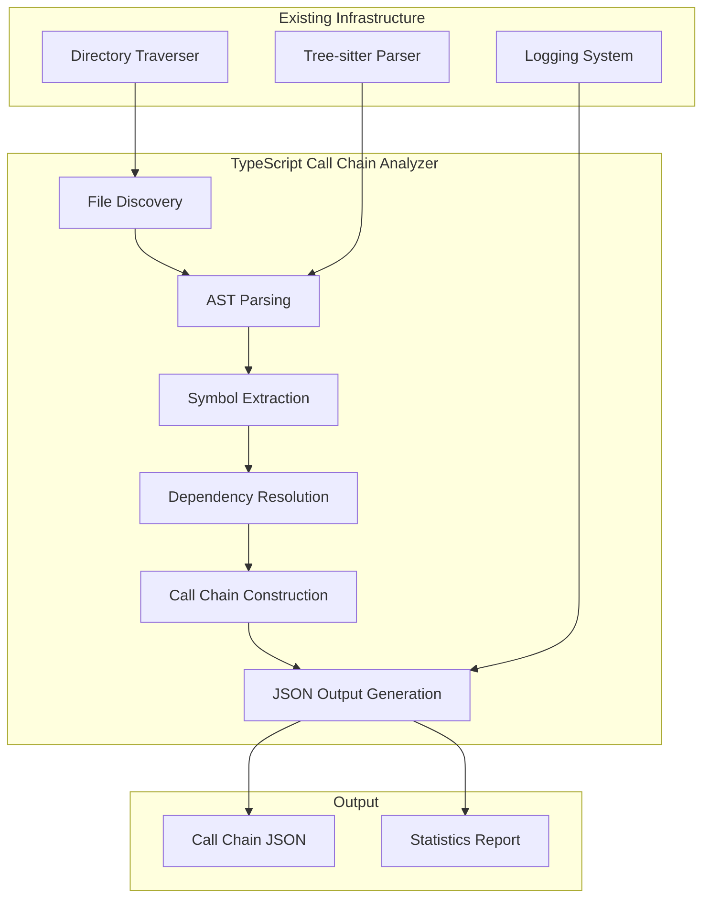

# Design Document - TypeScript Call Chain Analyzer (Complete)

## Overview

The TypeScript Call Chain Analyzer is a standalone module that extends the existing project-context-engine analyzer capabilities to provide comprehensive function call relationship analysis. The system will leverage the existing Tree-sitter infrastructure to parse TypeScript files and build a detailed call graph that tracks function declarations, method definitions, and their invocation relationships across multiple files.

## Architecture

### High-Level Architecture



### Module Structure

```
apps/analyzer/src/code-analyzer/call-chain/
├── index.ts              # Main analyzer entry point
├── cli.ts                # Command-line interface
├── parser.ts             # TypeScript-specific parsing logic
├── resolver.ts           # Cross-file dependency resolution
├── builder.ts            # Call chain construction
├── types.ts              # Type definitions
└── utils.ts              # Utility functions
```

## Components and Interfaces

### Core Types

```typescript
interface FunctionDefinition {
  id: string;
  name: string;
  type: 'function' | 'method' | 'arrow' | 'constructor';
  filePath: string;
  startLine: number;
  startColumn: number;
  endLine: number;
  endColumn: number;
  parameters: Parameter[];
  isAsync: boolean;
  isExported: boolean;
  className?: string;
  namespace?: string;
}

interface FunctionCall {
  id: string;
  callerId: string;
  calleeId: string;
  calleeName: string;
  filePath: string;
  line: number;
  column: number;
  isResolved: boolean;
  callType: 'direct' | 'method' | 'chained' | 'dynamic';
}

interface CallChain {
  entryPoint: string;
  depth: number;
  path: string[];
  isComplete: boolean;
  isTruncated: boolean;
  hasCircularReference: boolean;
}

interface AnalysisResult {
  functions: FunctionDefinition[];
  calls: FunctionCall[];
  chains: CallChain[];
  statistics: AnalysisStatistics;
}
```

### CallChainAnalyzer Class

```typescript
class CallChainAnalyzer {
  private parser: TypeScriptParser;
  private resolver: DependencyResolver;
  private builder: CallChainBuilder;
  
  constructor(options: AnalyzerOptions);
  
  public async analyze(projectPath: string): Promise<AnalysisResult>;
  private discoverFiles(projectPath: string): Promise<string[]>;
  private parseFile(filePath: string): Promise<ParseResult>;
  private extractSymbols(ast: Tree, filePath: string): SymbolExtractionResult;
  private resolveDependencies(symbols: SymbolExtractionResult[]): DependencyMap;
  private buildCallChains(dependencies: DependencyMap): CallChain[];
}
```

## Data Models

### Function Definition Model

Functions are identified and categorized based on their AST node types:

- **function_declaration**: Regular function declarations
- **method_definition**: Class methods, getters, setters
- **arrow_function**: Arrow function expressions
- **function_expression**: Function expressions
- **constructor**: Class constructors

### Call Relationship Model

Call relationships are tracked with different types:

- **direct**: Direct function calls `functionName()`
- **method**: Method calls `object.method()`
- **chained**: Method chaining `object.method1().method2()`
- **dynamic**: Dynamic calls using variables or computed properties

## Implementation Details

### AST Node Processing

Based on Tree-sitter TypeScript grammar <cite>[1]</cite>, the analyzer will process these key node types:

```typescript
const NODE_TYPES = {
  FUNCTION_DECLARATION: 'function_declaration',
  METHOD_DEFINITION: 'method_definition',
  ARROW_FUNCTION: 'arrow_function',
  FUNCTION_EXPRESSION: 'function_expression',
  CALL_EXPRESSION: 'call_expression',
  MEMBER_EXPRESSION: 'member_expression',
  IMPORT_STATEMENT: 'import_statement',
  EXPORT_STATEMENT: 'export_statement',
  IDENTIFIER: 'identifier',
  PROPERTY_IDENTIFIER: 'property_identifier'
};
```

### Dependency Resolution Algorithm

```typescript
class DependencyResolver {
  private importMap: Map<string, ImportInfo[]> = new Map();
  private exportMap: Map<string, ExportInfo[]> = new Map();
  
  resolveCall(call: FunctionCall, allFunctions: FunctionDefinition[]): string | null {
    // 1. Try local file resolution
    const localMatch = this.findLocalFunction(call);
    if (localMatch) return localMatch.id;
    
    // 2. Try imported function resolution
    const importedMatch = this.findImportedFunction(call);
    if (importedMatch) return importedMatch.id;
    
    // 3. Mark as unresolved
    return null;
  }
}
```

### JSON Output Format

```json
{
  "metadata": {
    "projectPath": "/path/to/project",
    "analyzedFiles": 150,
    "totalFunctions": 450,
    "totalCalls": 1200,
    "maxDepthReached": 8,
    "analysisDate": "2024-01-15T10:30:00Z"
  },
  "functions": [
    {
      "id": "func_001",
      "name": "processData",
      "type": "function",
      "filePath": "src/utils/processor.ts",
      "startLine": 15,
      "startColumn": 0,
      "endLine": 25,
      "endColumn": 1,
      "parameters": [
        {"name": "data", "type": "any[]"},
        {"name": "options", "type": "ProcessOptions"}
      ],
      "isAsync": true,
      "isExported": true
    }
  ],
  "calls": [
    {
      "id": "call_001",
      "callerId": "func_001",
      "calleeId": "func_002",
      "calleeName": "validateData",
      "filePath": "src/utils/processor.ts",
      "line": 18,
      "column": 12,
      "isResolved": true,
      "callType": "direct"
    }
  ],
  "chains": [
    {
      "entryPoint": "func_001",
      "depth": 3,
      "path": ["func_001", "func_002", "func_003"],
      "isComplete": true,
      "isTruncated": false,
      "hasCircularReference": false
    }
  ]
}
```

## Error Handling

### Parsing Errors

```typescript
class ParseError extends Error {
  constructor(
    message: string,
    public filePath: string,
    public line?: number,
    public column?: number
  ) {
    super(message);
  }
}
```

### Error Recovery Strategies

1. **Partial Analysis**: Continue analysis even when some files fail to parse
2. **Unresolved Calls**: Track calls that cannot be resolved to specific functions
3. **Graceful Degradation**: Provide partial results with error reporting
4. **Logging Integration**: Use existing Winston logging system for error tracking <cite>[2]</cite>

## Testing Strategy

### Unit Testing

```typescript
describe('CallChainAnalyzer', () => {
  describe('Function Extraction', () => {
    it('should extract function declarations');
    it('should extract class methods');
    it('should extract arrow functions');
    it('should handle async functions');
  });
  
  describe('Call Resolution', () => {
    it('should resolve direct function calls');
    it('should resolve method calls');
    it('should handle method chaining');
    it('should resolve cross-file calls');
  });
  
  describe('Chain Construction', () => {
    it('should build call chains with correct depth');
    it('should detect circular references');
    it('should truncate at maximum depth');
  });
});
```

## CLI Interface

Following the existing repomap CLI pattern <cite>[3]</cite>:

```bash
# Basic usage
node dist/code-analyzer/call-chain/cli.js /path/to/project

# With options
node dist/code-analyzer/call-chain/cli.js /path/to/project \
  --max-depth 5 \
  --output call-chains.json \
  --include "src/**/*.ts" \
  --exclude "**/*.test.ts"
```

### References

[1] [Tree-sitter TypeScript Grammar](https://raw.githubusercontent.com/tree-sitter/tree-sitter-typescript/master/tsx/src/node-types.json) - TypeScript AST node types
[2] [apps/analyzer/src/utils/log.ts](apps/analyzer/src/utils/log.ts) - Existing logging system
[3] [apps/analyzer/src/code-analyzer/repomap/cli.ts](apps/analyzer/src/code-analyzer/repomap/cli.ts) - Existing CLI interface patterns
[4] [apps/analyzer/src/code-analyzer/parser/index.ts](apps/analyzer/src/code-analyzer/parser/index.ts) - Existing Tree-sitter parser implementation
[5] [Reachability Analysis with Tree-sitter](https://kwekmh.com/posts/reachability-analysis-with-tree-sitter-in-rust-part-1/) - Tree-sitter analysis techniques