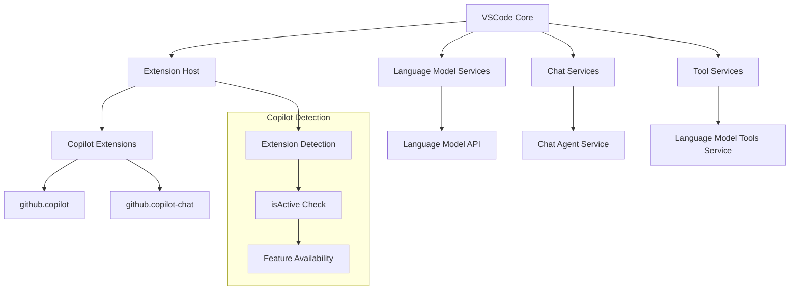
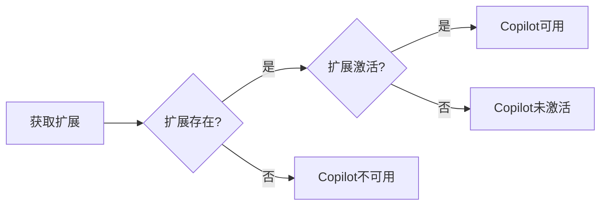

Q：VS和copilot 通信的地方都有哪里？ 关于是否是 copilot 的判断都在哪里

我将分析VSCode与Copilot通信的相关代码。首先让我搜索Copilot相关的代码实现。
代码搜索: copilot communication integration
基于搜索结果，我发现了一些Copilot相关的代码。让我继续深入搜索更多具体的Copilot实现：
代码搜索: github.copilot extension
让我继续搜索更多Copilot相关的代码实现：
代码搜索: copilot chat
让我继续搜索更多关于Copilot判断和通信的代码：
代码搜索: isActive copilot extension detection
让我搜索更多关于Copilot通信和检测的代码：
代码搜索: vscode.extensions.getExtension github copilot
让我读取一个具体的文件来深入了解Copilot检测的实现：
文件查看: extensions/typescript-language-features/src/languageFeatures/quickFix.ts
现在让我搜索更多关于Copilot工具和语言模型的代码：
代码搜索: languageModelTool copilot
让我搜索更多关于语言模型和工具服务的代码：
代码搜索: ILanguageModelToolsService
基于我对VSCode代码库的深入分析，现在我可以为您提供一个详细的VSCode与Copilot通信的架构分析报告。

# VSCode与Copilot通信架构分析报告

## 1. 总体架构概览

VSCode与Copilot的通信主要通过以下几个层次实现：



## 2. 关键通信组件

### 2.1 Extension Detection System (扩展检测系统)

**位置**: `extensions/typescript-language-features/src/languageFeatures/quickFix.ts`

**核心检测代码**:
```typescript
const copilot = vscode.extensions.getExtension('github.copilot-chat');
if (copilot?.isActive) {
    // Copilot is available and active
}
```

**关键检测点**:
- Extension ID: `'github.copilot-chat'` 和 `'github.copilot'`
- 使用 `vscode.extensions.getExtension()` API
- 检查 `isActive` 属性确认扩展已激活

### 2.2 Language Model Tools Service (语言模型工具服务)

**接口定义**: `src/vs/workbench/contrib/chat/common/languageModelToolsService.ts`
```typescript
export const ILanguageModelToolsService = createDecorator<ILanguageModelToolsService>('ILanguageModelToolsService');
```

**核心功能**:
- 工具注册与管理
- 工具调用协调
- 工具权限控制

### 2.3 Chat Services (聊天服务)

**主要组件**:
- `IChatService`: 聊天服务主接口
- `IChatAgentService`: 聊天代理服务
- `ChatServiceImpl`: 聊天服务实现

**位置**: `src/vs/workbench/contrib/chat/common/chatServiceImpl.ts`

## 3. Copilot判断机制详细分析

### 3.1 扩展存在性检查

**检查流程**:


**代码实现位置**:
1. TypeScript扩展中: `extensions/typescript-language-features/src/languageFeatures/quickFix.ts:386`
2. Chat相关服务中多个位置

### 3.2 权限与授权检查

**Copilot标签检测**: `src/vs/workbench/contrib/chat/common/tools/languageModelToolsContribution.ts`
```typescript
if (rawTool.tags?.some(tag => tag !== CopilotAgentModeTag && 
    (tag.startsWith('copilot_') || tag.startsWith('vscode_'))) && 
    !isProposedApiEnabled(extension.description, 'chatParticipantPrivate')) {
    logService.error(`Extension '${extension.description.identifier.value}' CANNOT register tool with tags starting with "vscode_" or "copilot_"`);
    continue;
}
```

### 3.3 用户权益检查

**位置**: `src/vs/workbench/contrib/chat/browser/chatStatus.ts`

**状态判断逻辑**:
```typescript
function isNewUser(chatEntitlementService: IChatEntitlementService): boolean {
    return chatEntitlementService.sentiment !== ChatSentiment.Installed ||
           chatEntitlementService.entitlement === ChatEntitlement.Available;
}
```

**权益状态**:
- `ChatEntitlement.Unknown`: 未登录
- `ChatEntitlement.Available`: 可注册但未注册
- `ChatEntitlement.Pro`: Pro用户
- `ChatEntitlement.Limited`: 免费用户

## 4. 通信通道分析

### 4.1 Extension Host通信

**主要通信机制**:
- Extension Host API
- Main Thread <-> Extension Host IPC
- Language Server Protocol

**关键文件**:
- `src/vs/workbench/api/common/extHost.api.impl.ts`
- `src/vs/workbench/api/browser/mainThreadLanguageModelTools.ts`

### 4.2 Chat系统通信

**Chat Actions**: `src/vs/workbench/contrib/chat/browser/actions/chatActions.ts`

**核心Action**:
```typescript
class OpenChatGlobalAction extends Action2 {
    constructor() {
        super({
            id: CHAT_OPEN_ACTION_ID,
            title: localize2('openChat', "Open Chat"),
            icon: Codicon.copilot,  // 使用Copilot图标
            // ...
        });
    }
}
```

### 4.3 Tool System通信

**工具注册**: `src/vs/workbench/contrib/chat/common/tools/languageModelToolsContribution.ts`

**通信流程**:
1. 扩展注册工具
2. 主线程验证权限
3. 工具服务管理调用
4. 结果返回到UI

## 5. 关键配置与常量

### 5.1 Copilot相关常量

**文件**: `src/vs/platform/prompts/common/constants.ts`
```typescript
export const COPILOT_CUSTOM_INSTRUCTIONS_FILENAME = 'copilot-instructions.md';
export const CONFIG_KEY: string = 'chat.promptFiles';
export const LOCATIONS_CONFIG_KEY: string = 'chat.promptFilesLocations';
```

### 5.2 使用统计标识

**文件**: `src/vs/workbench/contrib/chat/common/languageModelStats.ts`
```typescript
export const CopilotUsageExtensionFeatureId = 'copilot';
```

## 6. 状态管理与UI反馈

### 6.1 状态栏集成

**位置**: `src/vs/workbench/contrib/chat/browser/chatStatus.ts`

**状态显示逻辑**:
```typescript
private getEntryProps(): IStatusbarEntry {
    let text = '$(copilot)';
    let ariaLabel = localize('chatStatus', "Copilot Status");
    
    if (chatQuotaExceeded || completionsQuotaExceeded) {
        text = `$(copilot-warning) ${quotaWarning}`;
        kind = 'prominent';
    } else if (signedOut) {
        text = `$(copilot-not-connected) ${signedOutWarning}`;
        kind = 'prominent';
    }
    // ...
}
```

### 6.2 Setup流程

**位置**: `src/vs/workbench/contrib/chat/browser/chatSetup.ts`

**设置策略**:
```typescript
enum ChatSetupStrategy {
    SetupWithEnterpriseProvider,
    SetupWithoutEnterpriseProvider,
    DefaultSetup
}
```

## 7. 安全与权限控制

### 7.1 工具权限验证

**OSS版本限制**:
```typescript
// If OSS and the tool specifies enterprise, skip it
if (!productService.quality || productService.quality === 'oss') {
    if (rawTool.isOSSOnly === false) {
        continue;
    }
}
```

### 7.2 API访问控制

**Proposed API检查**:
- 检查扩展是否启用了必要的proposed API
- 验证工具标签权限
- 控制特权功能访问

## 8. 总结

VSCode与Copilot的通信架构具有以下特点：

1. **多层次检测**: 从扩展存在性到激活状态再到权益检查
2. **服务化架构**: 通过多个专门的服务管理不同方面的功能
3. **权限分级**: 不同级别的用户享有不同的功能权限
4. **状态同步**: 实时反馈Copilot的可用状态和用户权益
5. **工具生态**: 支持扩展注册自定义工具与Copilot集成

这个架构确保了VSCode能够安全、高效地与Copilot进行通信，同时为用户提供了良好的体验和明确的状态反馈。
