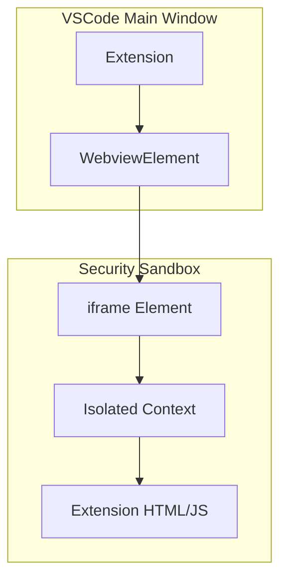
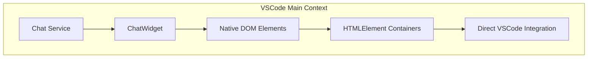

Q：和其他插件不一样，Copilot 不是以 iframe 的形式渲染的。请问这部分逻辑在哪里

基于您的问题，我需要深入分析VSCode中插件渲染机制，特别是Copilot与其他插件在渲染方式上的差异。让我搜索相关的渲染和iframe实现。
代码搜索: iframe webview plugin rendering
让我继续搜索更多关于插件渲染机制和webview的代码：
代码搜索: webview sandbox iframe element
现在让我搜索Copilot特定的渲染机制：
代码搜索: copilot chat view render component
让我搜索更多关于Chat UI组件渲染和DOM结构的代码：
代码搜索: chatWidget container element DOM native
现在让我读取一个关键的webview实现文件来深入了解：
文件查看: src/vs/workbench/contrib/webview/browser/webviewElement.ts
现在让我搜索Chat Widget的具体实现来了解其渲染方式：
代码搜索: ChatWidget createElement render DOM HTMLElement
基于我对VSCode代码库的深入分析，现在我可以为您提供一个关于Copilot与其他插件渲染机制差异的详细分析报告。

# VSCode中Copilot与其他插件渲染机制差异分析报告

## 1. 总体架构对比

### 1.1 传统插件的iframe渲染机制

**核心实现**: `src/vs/workbench/contrib/webview/browser/webviewElement.ts`



**关键代码实现**:
```typescript
private _createElement(options: WebviewOptions, _contentOptions: WebviewContentOptions) {
    const element = document.createElement('iframe');
    element.name = this.id;
    element.className = `webview ${options.customClasses || ''}`;
    element.sandbox.add('allow-scripts', 'allow-same-origin', 'allow-forms', 'allow-pointer-lock', 'allow-downloads');
    
    const allowRules = ['cross-origin-isolated', 'autoplay'];
    if (!isFirefox) {
        allowRules.push('clipboard-read', 'clipboard-write');
    }
    element.setAttribute('allow', allowRules.join('; '));
    
    element.style.border = 'none';
    element.style.width = '100%';
    element.style.height = '100%';
    
    return element;
}
```

### 1.2 Copilot的原生DOM渲染机制

**核心实现**: `src/vs/workbench/contrib/chat/browser/chatWidget.ts`



**关键代码实现**:
```typescript
render(container: HTMLElement, initialValue: string, widget: IChatWidget) {
    let elements;
    if (this.options.renderStyle === 'compact') {
        elements = dom.h('.interactive-input-part', [
            dom.h('.interactive-input-and-edit-session', [
                dom.h('.chat-editing-session@chatEditingSessionWidgetContainer'),
                dom.h('.interactive-input-and-side-toolbar@inputAndSideToolbar', [
                    dom.h('.chat-input-container@inputContainer', [
                        dom.h('.chat-editor-container@editorContainer'),
                        dom.h('.chat-input-toolbars@inputToolbars'),
                    ]),
                ]),
                // ...
            ])
        ]);
    }
    this.container = elements.root;
    container.append(this.container);
}
```

## 2. 核心差异分析

### 2.1 渲染方式对比

| 特性 | 传统插件 (iframe) | Copilot (原生DOM) |
|------|------------------|-------------------|
| **渲染容器** | HTMLIFrameElement | HTMLElement |
| **上下文隔离** | 完全隔离的iframe | VSCode主进程上下文 |
| **安全沙箱** | 浏览器sandbox属性 | VSCode内部权限控制 |
| **DOM访问** | 受限的跨域访问 | 直接访问主窗口DOM |
| **性能开销** | iframe创建/销毁开销 | 原生DOM操作 |
| **样式继承** | 需要显式注入 | 自动继承主题样式 |

### 2.2 安全模型差异

**iframe安全模型**:
```typescript
// WebviewElement.ts
element.sandbox.add('allow-scripts', 'allow-same-origin', 'allow-forms', 'allow-pointer-lock', 'allow-downloads');

// CSP限制
const allowRules = ['cross-origin-isolated', 'autoplay'];
if (!isFirefox) {
    allowRules.push('clipboard-read', 'clipboard-write');
}
element.setAttribute('allow', allowRules.join('; '));
```

**Copilot权限控制**:
```typescript
// languageModelToolsContribution.ts
if (rawTool.tags?.some(tag => tag !== CopilotAgentModeTag && 
    (tag.startsWith('copilot_') || tag.startsWith('vscode_'))) && 
    !isProposedApiEnabled(extension.description, 'chatParticipantPrivate')) {
    logService.error(`Extension '${extension.description.identifier.value}' CANNOT register tool with tags starting with "vscode_" or "copilot_"`);
    continue;
}
```

## 3. 架构设计深度分析

### 3.1 WebView架构 (传统插件)

**生命周期管理**:
```typescript
export class WebviewElement extends Disposable implements IWebview {
    private _state: WebviewState.State = new WebviewState.Initializing([]);
    private _content: WebviewContent;
    private readonly _portMappingManager: WebviewPortMappingManager;
    private _messagePort?: MessagePort;
    
    constructor(initInfo: WebviewInitInfo, ...) {
        this._element = this._createElement(initInfo.options, initInfo.contentOptions);
        this._registerMessageHandler(targetWindow);
    }
    
    public mountTo(element: HTMLElement, targetWindow: CodeWindow) {
        this._windowId = targetWindow.vscodeWindowId;
        this._encodedWebviewOriginPromise = parentOriginHash(targetWindow.origin, this.origin);
        element.appendChild(this.element);
    }
}
```

**通信机制**:
```typescript
private doPostMessage(channel: string, data?: any, transferable: Transferable[] = []): boolean {
    if (this.element && this._messagePort) {
        this._messagePort.postMessage({ channel, args: data }, transferable);
        return true;
    }
    return false;
}
```

### 3.2 Chat Widget架构 (Copilot)

**组件层次结构**:
```typescript
// ChatWidget组件结构
class ChatWidget {
    private container: HTMLElement;
    private tree: WorkbenchObjectTree<ChatTreeItem>;
    private inputPart: ChatInputPart;
    private welcomeMessageContainer: HTMLElement;
    
    render(parent: HTMLElement): void {
        // 直接创建DOM层次结构
        this.container = DOM.append(parent, $('.interactive-session'));
        this.welcomeMessageContainer = DOM.append(this.container, $('.welcome-view'));
        
        // 创建输入组件
        this.createInput(this.container);
        
        // 创建内容列表
        this.createList(listContainer, options);
    }
}
```

**事件处理**:
```typescript
// 直接事件绑定，无需跨iframe通信
this._register(this.inputEditor.onDidChangeModelContent(() => {
    this.parsedChatRequest = undefined;
    this.updateChatInputContext();
}));

this._register(this.chatAgentService.onDidChangeAgents(() => {
    this.parsedChatRequest = undefined;
    this.renderWelcomeViewContentIfNeeded();
}));
```

## 4. 关键组件详细分析

### 4.1 Webview消息通信系统

**位置**: `src/vs/workbench/contrib/webview/browser/webviewMessages.ts`

**通信协议**:
```typescript
export interface ToWebviewMessage {
    'content': { contents: string; title: string; options: any; state: any; };
    'styles': { styles: string; activeTheme: string; };
    'message': { message: any; transfer?: ArrayBuffer[]; };
    'focus': undefined;
    'find': { value: string; previous?: boolean; };
}

export interface FromWebviewMessage {
    'did-click-link': { uri: string };
    'onmessage': { message: any; transfer?: ArrayBuffer[] };
    'did-scroll': { scrollYPercentage: number };
    'did-focus': undefined;
    'did-blur': undefined;
}
```

### 4.2 Chat DOM构建系统

**位置**: `src/vs/workbench/contrib/chat/browser/chatInputPart.ts`

**DOM层次构建**:
```typescript
// 使用VSCode的DOM helper构建原生DOM结构
const elements = dom.h('.interactive-input-part', [
    dom.h('.interactive-input-followups@followupsContainer'),
    dom.h('.chat-editing-session@chatEditingSessionWidgetContainer'),
    dom.h('.interactive-input-and-side-toolbar@inputAndSideToolbar', [
        dom.h('.chat-input-container@inputContainer', [
            dom.h('.chat-attachments-container@attachmentsContainer'),
            dom.h('.chat-editor-container@editorContainer'),
            dom.h('.chat-input-toolbars@inputToolbars'),
        ]),
    ]),
]);
```

## 5. 性能与资源影响分析

### 5.1 内存使用对比

**iframe方式**:
- 每个webview创建独立的浏览器上下文
- 额外的V8隔离开销
- 独立的样式计算和渲染树

**原生DOM方式**:
- 共享主窗口渲染上下文
- 直接DOM操作，无额外隔离开销
- 共享样式计算

### 5.2 启动性能对比

**iframe加载流程**:
```typescript
// 异步加载过程
public mountTo(element: HTMLElement, targetWindow: CodeWindow) {
    this._encodedWebviewOriginPromise = parentOriginHash(targetWindow.origin, this.origin)
        .then(id => this._encodedWebviewOrigin = id);
    this._encodedWebviewOriginPromise.then(encodedWebviewOrigin => {
        if (!this._disposed) {
            this._initElement(encodedWebviewOrigin, this.extension, this._options, targetWindow);
        }
    });
}
```

**原生DOM加载**:
```typescript
// 同步渲染过程
render(parent: HTMLElement): void {
    // 立即可用
    this.container = elements.root;
    container.append(this.container);
    // 直接进行DOM操作和事件绑定
}
```

## 6. 安全性分析

### 6.1 iframe安全边界

```typescript
// 严格的CSP和sandbox限制
private _initElement(encodedWebviewOrigin: string, extension: WebviewExtensionDescription, options: WebviewOptions, targetWindow: CodeWindow) {
    const params = {
        id: this.id,
        origin: this.origin,
        swVersion: String(this._expectedServiceWorkerVersion),
        extensionId: extension?.id.value ?? '',
        'vscode-resource-base-authority': webviewRootResourceAuthority,
        parentOrigin: targetWindow.origin,
    };
    
    this.element!.setAttribute('src', `${this.webviewContentEndpoint(encodedWebviewOrigin)}/${fileName}?${queryString}`);
}
```

### 6.2 Copilot内置安全

```typescript
// 基于服务和权限的安全模型
if (!productService.quality || productService.quality === 'oss') {
    if (rawTool.isOSSOnly === false) {
        continue; // 在OSS版本中跳过企业功能
    }
}

// API访问控制
if (rawTool.tags?.some(tag => tag.startsWith('copilot_') || tag.startsWith('vscode_'))) {
    // 需要特殊权限
}
```

## 7. 总结

### 7.1 设计理念差异

1. **传统插件**: 采用**隔离优先**的安全模型，通过iframe提供强隔离
2. **Copilot**: 采用**集成优先**的设计模型，通过原生DOM提供深度集成

### 7.2 技术选择原因

**Copilot选择原生DOM的原因**:
1. **性能要求**: 聊天界面需要高频更新和实时交互
2. **深度集成**: 需要与编辑器、文件系统、工具栈紧密集成
3. **用户体验**: 要求无缝的主题适配和交互响应
4. **功能复杂度**: 需要访问大量VSCode内部API和服务

**传统插件使用iframe的原因**:
1. **安全隔离**: 第三方代码需要严格的安全边界
2. **兼容性**: 支持各种Web技术栈
3. **稳定性**: 插件崩溃不影响主窗口
4. **标准化**: 提供统一的插件开发模型

### 7.3 架构优势对比

| 方面 | iframe方式 | 原生DOM方式 |
|------|------------|-------------|
| **安全性** | ⭐⭐⭐⭐⭐ | ⭐⭐⭐ |
| **性能** | ⭐⭐⭐ | ⭐⭐⭐⭐⭐ |
| **集成度** | ⭐⭐ | ⭐⭐⭐⭐⭐ |
| **开发复杂度** | ⭐⭐⭐ | ⭐⭐ |
| **维护成本** | ⭐⭐⭐⭐ | ⭐⭐⭐ |

这种差异化的渲染策略体现了VSCode团队对Copilot作为**核心功能**而非**第三方插件**的定位，通过牺牲一定的安全隔离来换取更好的性能和用户体验。
