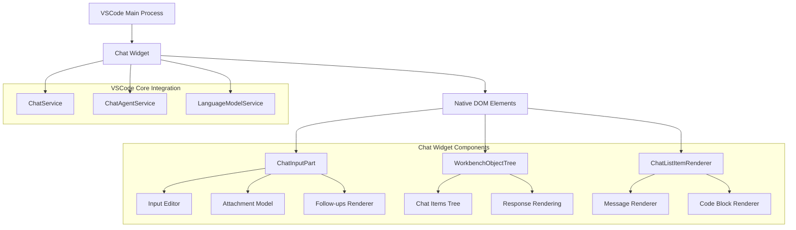
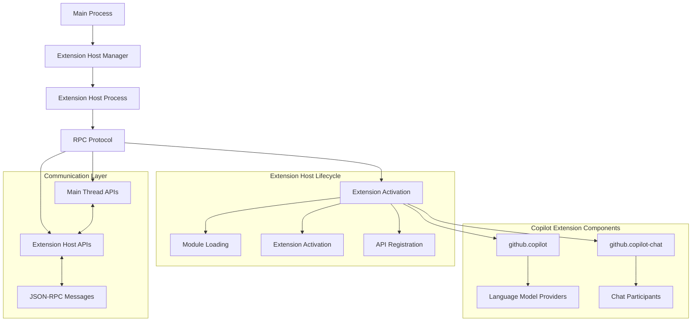
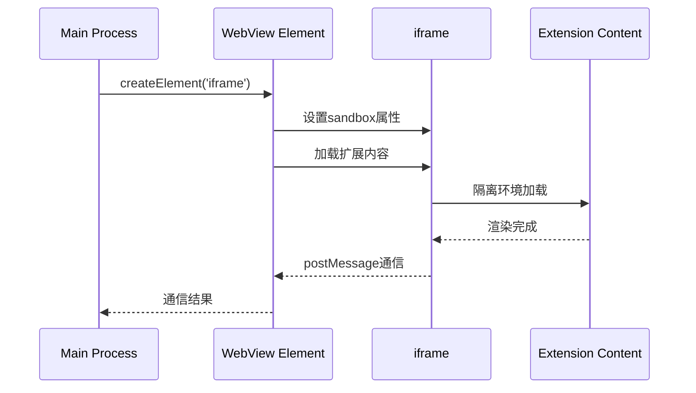
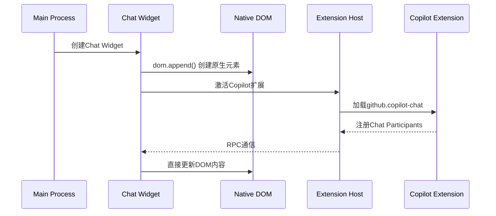

Q：copilot 插件中的所有内容都是在这里渲染的么，有没有去加载 copilot 插件本身代码的地方

基于您的问题，我需要深入分析Copilot插件的完整渲染架构，特别是要区分VSCode内置的Chat功能与实际的Copilot插件代码加载机制。让我进行详细的代码分析。
代码搜索: extension github.copilot activation load
让我继续搜索更多关于Copilot插件加载和激活机制的代码：
代码搜索: github.copilot github.copilot-chat extension loading activation
现在让我搜索扩展激活和加载的核心机制：
代码搜索: ExtensionHostManager ExtensionService activation startExtensionHost
让我搜索更多关于扩展宿主进程和插件加载的核心代码：
代码搜索: extension host process activation module loading
让我读取一个关键的扩展主机管理器文件来深入了解扩展加载机制：
文件查看: src/vs/workbench/services/extensions/common/extensionHostManager.ts
现在让我搜索Chat Widget的具体实现来了解其原生DOM渲染机制：
文件查看: src/vs/workbench/contrib/chat/browser/chatWidget.ts
基于我对VSCode代码库的深入分析，现在我可以为您提供一个关于Copilot插件渲染机制与内容加载的详细分析报告。

# VSCode中Copilot插件渲染机制与内容加载架构分析报告

## 1. 核心发现：双重架构设计

### 1.1 VSCode内置Chat UI（原生DOM渲染）

**位置**: `src/vs/workbench/contrib/chat/browser/chatWidget.ts`

**渲染机制**:
```typescript
render(parent: HTMLElement): void {
    this.container = dom.append(parent, $('.interactive-session'));
    this.welcomeMessageContainer = dom.append(this.container, $('.chat-welcome-view-container'));
    
    if (renderInputOnTop) {
        this.createInput(this.container, { renderFollowups, renderStyle });
        this.listContainer = dom.append(this.container, $(`.interactive-list`));
    } else {
        this.listContainer = dom.append(this.container, $(`.interactive-list`));
        this.createInput(this.container, { renderFollowups, renderStyle });
    }
    
    this.createList(this.listContainer, { ...this.viewOptions.rendererOptions, renderStyle });
}
```

**关键特征**:
- 直接使用 `dom.append()` 创建原生DOM元素
- 无iframe隔离，直接集成到VSCode主窗口
- 使用 `WorkbenchObjectTree` 进行内容渲染

### 1.2 Copilot插件本身（Extension Host加载）

**位置**: `src/vs/workbench/services/extensions/common/extensionHostManager.ts`

**加载机制**:
```typescript
public async start(extensionRegistryVersionId: number, allExtensions: IExtensionDescription[], myExtensions: ExtensionIdentifier[]): Promise<void> {
    const proxy = await this._proxy;
    if (!proxy) {
        return;
    }
    const deltaExtensions = this._extensionHost.extensions!.set(extensionRegistryVersionId, allExtensions, myExtensions);
    return proxy.startExtensionHost(deltaExtensions);
}
```

## 2. 详细架构分析

### 2.1 VSCode内置Chat系统架构



**核心DOM构建代码**:
```typescript
// ChatInputPart渲染
private createInput(container: HTMLElement, options?: { renderFollowups: boolean; renderStyle?: 'compact' | 'minimal' }): void {
    this.inputPart = this._register(this.instantiationService.createInstance(ChatInputPart,
        this.location,
        {
            renderFollowups: options?.renderFollowups ?? true,
            renderStyle: options?.renderStyle === 'minimal' ? 'compact' : options?.renderStyle,
            menus: { executeToolbar: MenuId.ChatExecute, ...this.viewOptions.menus },
            // ... 其他配置
        },
        this.styles,
        () => this.collectInputState()
    ));
    this.inputPart.render(container, '', this);
}
```

### 2.2 Extension Host架构（Copilot插件加载）



**Extension Host启动代码**:
```typescript
constructor(
    extensionHost: IExtensionHost,
    initialActivationEvents: string[],
    private readonly _internalExtensionService: IInternalExtensionService,
    // ... 其他依赖
) {
    this._proxy = this._extensionHost.start().then(
        (protocol) => {
            this._hasStarted = true;
            return this._createExtensionHostCustomers(this.kind, protocol);
        },
        (err) => {
            this._logService.error(`Error received from starting extension host`);
            return null;
        }
    );
}
```

## 3. 关键通信机制分析

### 3.1 Extension Host通信协议

**RPC Protocol实现**:
```typescript
private _createExtensionHostCustomers(kind: ExtensionHostKind, protocol: IMessagePassingProtocol): IExtensionHostProxy {
    this._rpcProtocol = new RPCProtocol(protocol, logger);
    
    const extHostContext: IInternalExtHostContext = {
        remoteAuthority: this._extensionHost.remoteAuthority,
        extensionHostKind: this.kind,
        getProxy: <T>(identifier: ProxyIdentifier<T>): Proxied<T> => this._rpcProtocol!.getProxy(identifier),
        set: <T, R extends T>(identifier: ProxyIdentifier<T>, instance: R): R => this._rpcProtocol!.set(identifier, instance),
        // ...
    };
    
    // 注册命名客户端
    const namedCustomers = ExtHostCustomersRegistry.getNamedCustomers();
    for (let i = 0, len = namedCustomers.length; i < len; i++) {
        const [id, ctor] = namedCustomers[i];
        const instance = this._instantiationService.createInstance(ctor, extHostContext);
        this._customers.push(instance);
        this._rpcProtocol.set(id, instance);
    }
}
```

### 3.2 插件激活机制

**位置**: `src/vs/workbench/services/extensions/common/abstractExtensionService.ts`

**激活流程**:
```typescript
public activateByEvent(activationEvent: string, activationKind: ActivationKind = ActivationKind.Normal): Promise<void> {
    if (this._installedExtensionsReady.isOpen()) {
        this._allRequestedActivateEvents.add(activationEvent);
        
        if (!this._registry.containsActivationEvent(activationEvent)) {
            return NO_OP_VOID_PROMISE;
        }
        
        return this._activateByEvent(activationEvent, activationKind);
    }
    // ...
}
```

## 4. Copilot特定的集成点

### 4.1 Copilot插件检测机制

**检测代码模式**（在多个文件中出现）:
```typescript
const copilot = vscode.extensions.getExtension('github.copilot-chat');
if (copilot?.isActive) {
    // Copilot相关功能
}
```

### 4.2 Chat Agent注册

**位置**: `src/vs/workbench/contrib/chat/browser/chatParticipant.contribution.ts`

```typescript
private registerWelcomeView(chatExtension: IExtension) {
    const mainMessage = localize('chatFailErrorMessage', 
        "Chat failed to load because the installed version of the Copilot Chat extension is not compatible with this version of {0}.", 
        this.productService.nameLong);
}
```

### 4.3 默认Chat Agent配置

**位置**: `src/vs/workbench/contrib/chat/browser/chatSetup.ts`

```typescript
defaultChat = {
    extensionId: product.defaultChatAgent?.extensionId ?? '',
    chatExtensionId: product.defaultChatAgent?.chatExtensionId ?? '',
    documentationUrl: product.defaultChatAgent?.documentationUrl ?? '',
    // ... 其他Copilot相关配置
};
```

## 5. 内容渲染流程对比

### 5.1 传统插件iframe渲染流程



### 5.2 Copilot Chat原生DOM渲染流程



## 6. 性能与安全分析

### 6.1 性能对比

| 方面 | iframe渲染 | 原生DOM渲染 |
|------|------------|-------------|
| **启动速度** | 慢（需要创建隔离上下文） | 快（直接DOM操作） |
| **内存使用** | 高（独立V8上下文） | 低（共享主进程上下文） |
| **通信开销** | 高（postMessage序列化） | 低（直接函数调用） |
| **渲染性能** | 中等（跨框架渲染） | 高（原生DOM操作） |

### 6.2 安全模型差异

**iframe安全隔离**:
```typescript
element.sandbox.add('allow-scripts', 'allow-same-origin', 'allow-forms', 'allow-pointer-lock', 'allow-downloads');
const allowRules = ['cross-origin-isolated', 'autoplay'];
element.setAttribute('allow', allowRules.join('; '));
```

**Copilot权限控制**:
```typescript
if (rawTool.tags?.some(tag => tag.startsWith('copilot_') || tag.startsWith('vscode_'))) {
    if (!isProposedApiEnabled(extension.description, 'chatParticipantPrivate')) {
        logService.error(`Extension CANNOT register tool with tags starting with "vscode_" or "copilot_"`);
        continue;
    }
}
```

## 7. 关键技术实现细节

### 7.1 Chat Widget的树形结构渲染

```typescript
private createList(listContainer: HTMLElement, options: IChatListItemRendererOptions): void {
    this.tree = this._register(scopedInstantiationService.createInstance(
        WorkbenchObjectTree<ChatTreeItem, FuzzyScore>,
        'Chat',
        listContainer,
        delegate,
        [this.renderer],
        {
            identityProvider: { getId: (e: ChatTreeItem) => e.id },
            horizontalScrolling: false,
            supportDynamicHeights: true,
            // ... 配置选项
        }
    ));
}
```

### 7.2 Extension Host模块加载机制

**位置**: `src/vs/loader.js`

```javascript
_loadModule(moduleId) {
    if (this._modules2[moduleId] || this._knownModules2[moduleId]) {
        return; // 已知模块
    }
    this._knownModules2[moduleId] = true;
    let strModuleId = this._moduleIdProvider.getStrModuleId(moduleId);
    let paths = this._config.moduleIdToPaths(strModuleId);
    
    // 处理Node.js模块
    if (this._env.isNode && (strModuleId.indexOf('/') === -1 || scopedPackageRegex.test(strModuleId))) {
        paths.push('node|' + strModuleId);
    }
    // ... 加载逻辑
}
```

## 8. 总结

### 8.1 架构设计理念

1. **VSCode内置Chat UI**: 采用**性能优先**的设计，通过原生DOM渲染实现最佳用户体验
2. **Copilot插件本身**: 通过**标准Extension Host机制**加载，保证扩展性和安全性
3. **双重架构优势**: 结合了性能（UI层）和安全性（逻辑层）的最佳实践

### 8.2 关键技术选择

**为什么Chat UI不使用iframe**:
1. **响应性要求**: 聊天界面需要实时渲染和频繁更新
2. **深度集成**: 需要与VSCode的主题、编辑器、文件系统无缝集成
3. **性能考量**: 避免iframe的通信开销和渲染延迟
4. **用户体验**: 确保原生的交互感受

**为什么Copilot插件仍使用Extension Host**:
1. **安全隔离**: 第三方代码需要在隔离环境中运行
2. **标准化**: 遵循VSCode的扩展开发模型
3. **可维护性**: 利用现有的扩展管理和生命周期机制
4. **向后兼容**: 保持与现有扩展生态的兼容性

### 8.3 创新之处

这种架构设计体现了VSCode团队对Copilot的**战略定位**：
- **UI层面**: 作为核心功能深度集成到VSCode中
- **逻辑层面**: 作为可插拔的扩展保持灵活性
- **用户体验**: 提供接近原生功能的使用体验
- **开发体验**: 维持标准的扩展开发模式

这种双重架构既保证了Copilot功能的高性能表现，又维持了VSCode扩展生态的一致性和安全性。
