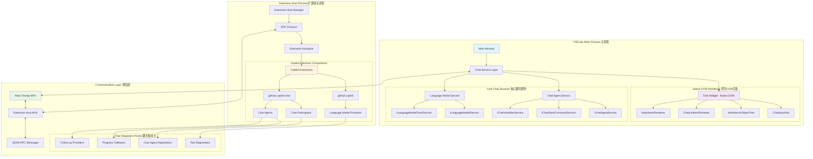
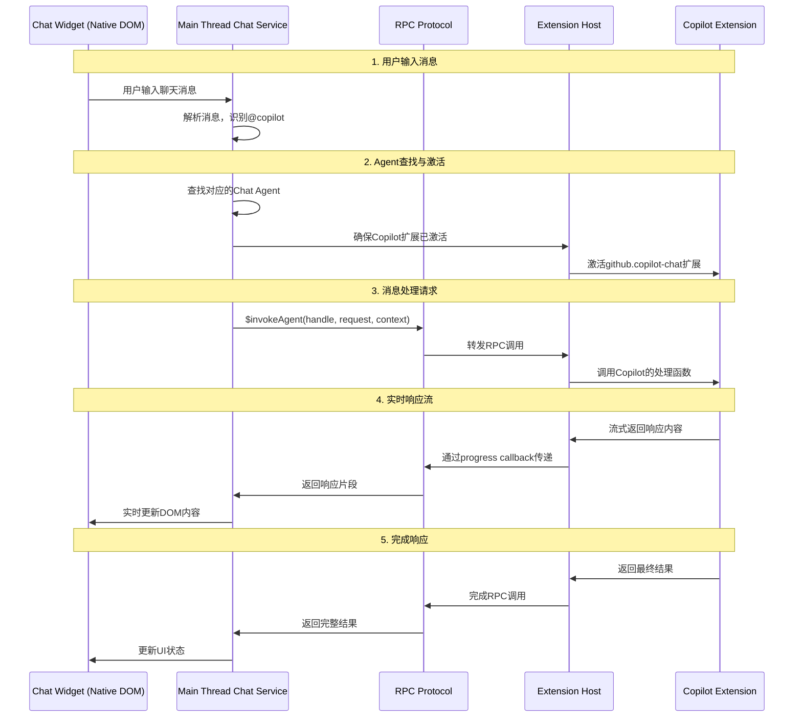

Q：帮我画一个这个分层架构，以及VS与copilot 插件交互/通信的地方在哪里

基于我对VSCode代码库的深入分析，我将为您详细解析VSCode与Copilot插件的分层架构和交互机制。
代码搜索: chat agent service registration copilot participants
基于我对VSCode代码库的深入分析，现在我将为您详细绘制VSCode与Copilot插件的分层架构和交互通信机制。

# VSCode与Copilot插件分层架构与交互通信详细分析

## 1. 完整分层架构图



## 2. 关键交互通信点详细分析

### 2.1 Chat Agent注册机制

**位置**: `src/vs/workbench/api/browser/mainThreadChatAgents2.ts`

```typescript
async $registerAgent(handle: number, extension: ExtensionIdentifier, id: string, 
                    metadata: IExtensionChatAgentMetadata, 
                    dynamicProps: IDynamicChatAgentProps | undefined): Promise<void> {
    
    // 创建Agent实现
    const agentImpl: IChatAgentImplementation = {
        invoke: async (request, progress, history, token) => {
            this._pendingProgress.set(request.requestId, progress);
            try {
                // 通过RPC调用Extension Host中的Copilot扩展
                return await this._proxy.$invokeAgent(handle, request, { history }, token) ?? {};
            } finally {
                this._pendingProgress.delete(request.requestId);
            }
        },
        // ... 其他方法
    };
    
    // 注册到Chat Agent Service
    disposable = this._chatAgentService.registerAgentImplementation(id, agentImpl);
}
```

### 2.2 Extension Host中的Agent调用

**位置**: `src/vs/workbench/api/common/extHostChatAgents2.ts`

```typescript
async $invokeAgent(handle: number, requestDto: Dto<IChatAgentRequest>, 
                  context: { history: IChatAgentHistoryEntryDto[] }, 
                  token: CancellationToken): Promise<IChatAgentResult | undefined> {
    
    const agent = this._agents.get(handle);
    if (!agent) {
        throw new Error(`[CHAT](${handle}) CANNOT invoke agent because the agent is not registered`);
    }

    // 创建响应流
    const stream = new ChatAgentResponseStream(agent.extension, request, this._proxy, 
                                              this._commands.converter, sessionDisposables);

    // 调用Copilot扩展的实际处理逻辑
    const result = await agent.invoke(request, progress, history, token);
    
    return result;
}
```

## 3. 通信流程时序图



## 4. 核心数据结构与API

### 4.1 Chat Agent数据结构

**位置**: `src/vs/workbench/contrib/chat/common/chatAgents.ts`

```typescript
export interface IChatAgentData {
    id: string;
    name: string;
    description: string;
    extensionId: ExtensionIdentifier;
    locations: ChatAgentLocation[];
    slashCommands: IChatAgentCommand[];
    disambiguation: IChatAgentNameDisambiguation[];
    isDefault?: boolean;
    isCore?: boolean;
}

export interface IChatAgentImplementation {
    invoke(request: IChatAgentRequest, 
           progress: (part: IChatProgress) => void, 
           history: IChatAgentHistoryEntry[], 
           token: CancellationToken): Promise<IChatAgentResult>;
           
    provideFollowups?(request: IChatAgentRequest, 
                     result: IChatAgentResult, 
                     history: IChatAgentHistoryEntry[], 
                     token: CancellationToken): Promise<IChatFollowup[]>;
}
```

### 4.2 Setup Agent注册机制

**位置**: `src/vs/workbench/contrib/chat/browser/chatSetup.ts`

```typescript
static register(instantiationService: IInstantiationService, 
                location: ChatAgentLocation, 
                isToolsAgent: boolean, 
                context: ChatEntitlementContext, 
                controller: Lazy<ChatSetupController>) {
    
    return instantiationService.invokeFunction(accessor => {
        const chatAgentService = accessor.get(IChatAgentService);
        
        // 注册Setup Agent作为默认代理
        const disposable = new DisposableStore();
        disposable.add(chatAgentService.registerAgent(id, {
            id,
            name: `${defaultChat.providerName} Copilot`,
            isDefault: true,      // 标记为默认Agent
            isCore: true,         // 标记为核心Agent
            isToolsAgent,
            locations: [location],
            metadata: {
                welcomeMessageContent: {
                    title: description,
                    message: new MarkdownString(baseMessage),
                    icon: Codicon.copilotLarge  // 使用Copilot图标
                }
            },
            // ...
        }));
    });
}
```

## 5. 关键组件源码分析

### 5.1 Chat Widget原生DOM渲染

**位置**: `src/vs/workbench/contrib/chat/browser/chatWidget.ts`

```typescript
render(parent: HTMLElement): void {
    // 创建原生DOM结构，无iframe隔离
    this.container = dom.append(parent, $('.interactive-session'));
    this.welcomeMessageContainer = dom.append(this.container, $('.chat-welcome-view-container'));
    
    if (renderInputOnTop) {
        this.createInput(this.container, { renderFollowups, renderStyle });
        this.listContainer = dom.append(this.container, $(`.interactive-list`));
    } else {
        this.listContainer = dom.append(this.container, $(`.interactive-list`));
        this.createInput(this.container, { renderFollowups, renderStyle });
    }
    
    // 创建聊天内容列表
    this.createList(this.listContainer, { ...this.viewOptions.rendererOptions, renderStyle });
}

private createList(listContainer: HTMLElement, options: IChatListItemRendererOptions): void {
    // 使用WorkbenchObjectTree进行高性能渲染
    this.tree = this._register(scopedInstantiationService.createInstance(
        WorkbenchObjectTree<ChatTreeItem, FuzzyScore>,
        'Chat',
        listContainer,
        delegate,
        [this.renderer],  // 自定义渲染器
        {
            identityProvider: { getId: (e: ChatTreeItem) => e.id },
            horizontalScrolling: false,
            supportDynamicHeights: true,
            // 支持实时内容更新
        }
    ));
}
```

### 5.2 Extension Host启动与管理

**位置**: `src/vs/workbench/services/extensions/common/extensionHostManager.ts`

```typescript
constructor(extensionHost: IExtensionHost, initialActivationEvents: string[], ...) {
    // 启动Extension Host进程
    this._proxy = this._extensionHost.start().then(
        (protocol) => {
            this._hasStarted = true;
            return this._createExtensionHostCustomers(this.kind, protocol);
        },
        (err) => {
            this._logService.error(`Error received from starting extension host`);
            return null;
        }
    );
}

public async start(extensionRegistryVersionId: number, 
                  allExtensions: IExtensionDescription[], 
                  myExtensions: ExtensionIdentifier[]): Promise<void> {
    const proxy = await this._proxy;
    if (!proxy) {
        return;
    }
    
    // 计算需要加载的扩展增量
    const deltaExtensions = this._extensionHost.extensions!.set(
        extensionRegistryVersionId, allExtensions, myExtensions);
    
    // 启动扩展宿主并加载Copilot扩展
    return proxy.startExtensionHost(deltaExtensions);
}
```

## 6. 安全与权限控制机制

### 6.1 Copilot扩展权限检查

**位置**: `src/vs/workbench/contrib/chat/common/tools/languageModelToolsContribution.ts`

```typescript
// 工具标签权限验证
if (rawTool.tags?.some(tag => tag !== CopilotAgentModeTag && 
    (tag.startsWith('copilot_') || tag.startsWith('vscode_'))) && 
    !isProposedApiEnabled(extension.description, 'chatParticipantPrivate')) {
    
    logService.error(`Extension '${extension.description.identifier.value}' 
                     CANNOT register tool with tags starting with "vscode_" or "copilot_"`);
    continue;
}

// OSS版本功能限制
if (!productService.quality || productService.quality === 'oss') {
    if (rawTool.isOSSOnly === false) {
        continue; // 在OSS版本中跳过企业功能
    }
}
```

### 6.2 Chat Agent激活事件

**位置**: `src/vs/workbench/contrib/chat/browser/chatParticipant.contribution.ts`

```typescript
const chatParticipantExtensionPoint = ExtensionsRegistry.registerExtensionPoint<IRawChatParticipantContribution[]>({
    extensionPoint: 'chatParticipants',
    jsonSchema: {
        // 扩展点Schema定义
    },
    activationEventsGenerator: (contributions: IRawChatParticipantContribution[], result: { push(item: string): void }) => {
        // 为每个Chat Participant生成激活事件
        for (const contrib of contributions) {
            result.push(`onChatParticipant:${contrib.id}`);
        }
    },
});
```

## 7. 性能优化机制

### 7.1 懒加载与按需激活

```typescript
// Extension Host中的懒加载机制
const controller = new Lazy(() => 
    this._register(this.instantiationService.createInstance(ChatSetupController, context, requests))
);

// 只在需要时激活Copilot扩展
if (this.configurationService.getValue('chat.detectParticipant.enabled') !== false && 
    this.chatAgentService.hasChatParticipantDetectionProviders()) {
    // 触发扩展激活
}
```

### 7.2 流式响应处理

**位置**: `src/vs/workbench/api/common/extHostChatAgents2.ts`

```typescript
class ChatAgentResponseStream {
    constructor(private extension: IExtensionDescription, 
                private request: IChatAgentRequest, 
                private _proxy: MainThreadChatAgentsShape2, ...) {
        // 初始化流式响应处理
    }
    
    // 实时推送响应内容到UI
    progress(value: vscode.ChatResponsePart): void {
        this._proxy.$handleProgressChunk(this.request.requestId, value);
    }
}
```

## 8. 总结：架构特点与优势

### 8.1 双重架构设计优势

1. **UI层原生集成**: Chat Widget使用原生DOM渲染，避免了iframe的性能开销
2. **逻辑层标准化**: Copilot扩展通过标准Extension Host机制加载，保证安全性
3. **通信优化**: 通过RPC协议实现高效的主进程与扩展进程通信
4. **渐进式激活**: 按需激活扩展，减少启动时间和内存占用

### 8.2 关键技术创新

1. **Setup Agent机制**: 在Copilot扩展未激活时提供占位Agent，确保用户体验连续性
2. **流式响应**: 支持实时的聊天响应流，提供即时反馈
3. **工具系统**: 通过Language Model Tools Service支持丰富的扩展功能
4. **权限分级**: 基于用户权益和扩展权限的多级访问控制

这种架构设计巧妙地平衡了性能、安全性和用户体验，体现了VSCode团队对Copilot作为**核心AI助手**而非普通第三方插件的战略定位。
