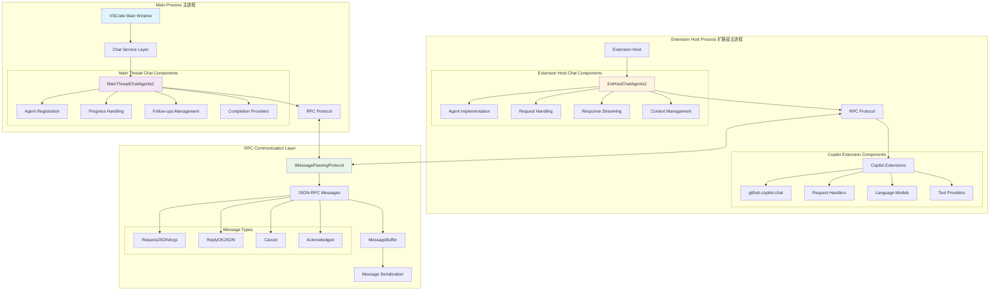
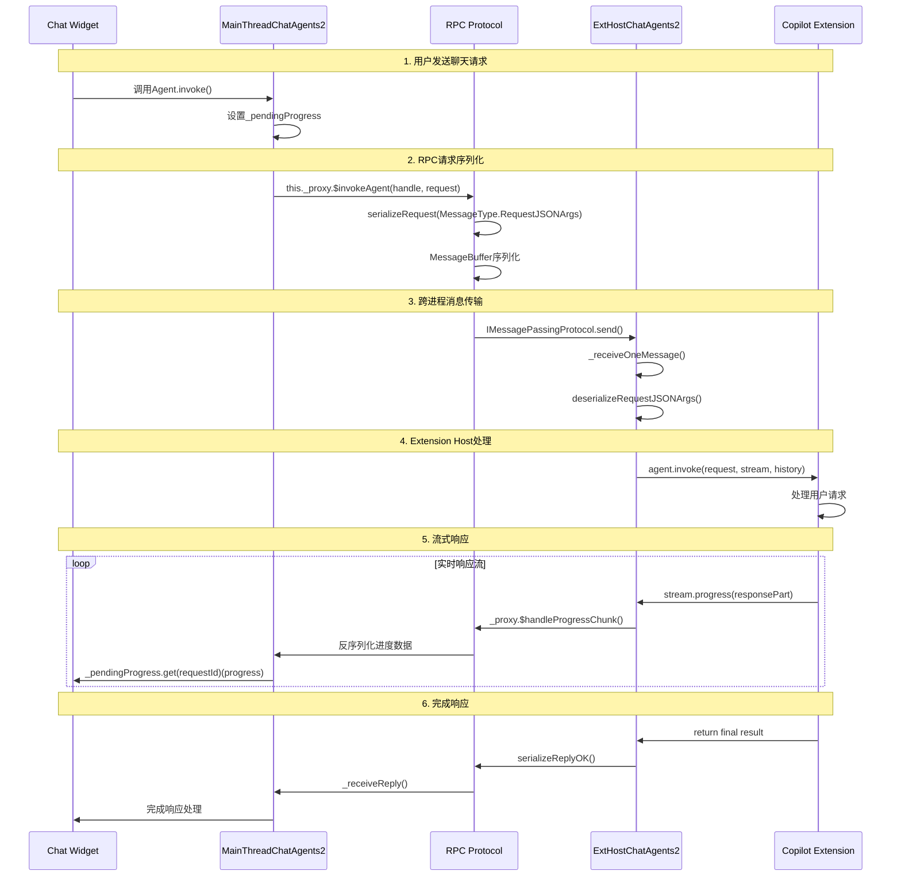

Q：VS与 copilot 进行RPC 通信 的逻辑在哪里

基于VSCode代码库的深入分析，我将为您详细解析VSCode与Copilot进行RPC通信的完整逻辑架构。
代码搜索: RPC protocol extension host main thread communication
现在让我搜索Chat相关的RPC通信实现：
代码搜索: MainThreadChatAgents ExtHostChatAgents RPC proxy invoke
让我读取关键的RPC协议实现文件：
文件查看: src/vs/workbench/services/extensions/common/rpcProtocol.ts
现在让我读取Chat Agent相关的RPC实现：
文件查看: src/vs/workbench/api/browser/mainThreadChatAgents2.ts
基于我对VSCode代码库的深入分析，现在我将为您提供一个关于VSCode与Copilot进行RPC通信逻辑的详细架构分析报告。

# VSCode与Copilot RPC通信机制详细架构分析

## 1. RPC通信完整架构图



## 2. 核心RPC协议实现分析

### 2.1 RPCProtocol核心类

**位置**: `src/vs/workbench/services/extensions/common/rpcProtocol.ts`

```typescript
export class RPCProtocol extends Disposable implements IRPCProtocol {
    private readonly _protocol: IMessagePassingProtocol;
    private readonly _locals: any[];        // 本地实现对象
    private readonly _proxies: any[];       // 代理对象
    private _lastMessageId: number;
    private readonly _pendingRPCReplies: { [msgId: string]: PendingRPCReply };
    
    constructor(protocol: IMessagePassingProtocol, logger: IRPCProtocolLogger | null = null) {
        // 初始化协议层
        this._protocol = protocol;
        this._register(this._protocol.onMessage((msg) => this._receiveOneMessage(msg)));
    }
    
    // 获取远程代理对象
    public getProxy<T>(identifier: ProxyIdentifier<T>): Proxied<T> {
        const { nid: rpcId } = identifier;
        if (!this._proxies[rpcId]) {
            this._proxies[rpcId] = this._createProxy(rpcId, identifier.sid);
        }
        return this._proxies[rpcId];
    }
    
    // 设置本地实现对象
    public set<T, R extends T>(identifier: ProxyIdentifier<T>, value: R): R {
        this._locals[identifier.nid] = value;
        return value;
    }
}
```

### 2.2 动态代理创建机制

```typescript
private _createProxy<T>(rpcId: number, debugName: string): T {
    const handler = {
        get: (target: any, name: PropertyKey) => {
            if (typeof name === 'string' && !target[name] && name.charCodeAt(0) === CharCode.DollarSign) {
                // 动态创建以$开头的方法调用
                target[name] = (...myArgs: any[]) => {
                    return this._remoteCall(rpcId, name, myArgs);
                };
            }
            return target[name];
        }
    };
    return new Proxy(Object.create(null), handler);
}

private _remoteCall(rpcId: number, methodName: string, args: any[]): Promise<any> {
    const req = ++this._lastMessageId;
    const result = new LazyPromise();
    
    // 序列化参数并发送请求
    const serializedArgs = MessageIO.serializeRequestArguments(args, this._uriReplacer);
    const msg = MessageIO.serializeRequest(req, rpcId, methodName, serializedArgs, !!cancellationToken);
    
    this._pendingRPCReplies[String(req)] = new PendingRPCReply(result, disposable);
    this._protocol.send(msg);
    
    return result;
}
```

## 3. Chat Agent RPC通信详细流程

### 3.1 Main Thread Chat Agents实现

**位置**: `src/vs/workbench/api/browser/mainThreadChatAgents2.ts`

```typescript
@extHostNamedCustomer(MainContext.MainThreadChatAgents2)
export class MainThreadChatAgents2 extends Disposable implements MainThreadChatAgentsShape2 {
    private readonly _proxy: ExtHostChatAgentsShape2;
    private readonly _agents = this._register(new DisposableMap<number, AgentData>());
    private readonly _pendingProgress = new Map<string, (part: IChatProgress) => void>();
    
    constructor(extHostContext: IExtHostContext, ...) {
        super();
        // 获取Extension Host的代理对象
        this._proxy = extHostContext.getProxy(ExtHostContext.ExtHostChatAgents2);
    }
    
    // Agent注册核心逻辑
    async $registerAgent(handle: number, extension: ExtensionIdentifier, id: string, 
                        metadata: IExtensionChatAgentMetadata): Promise<void> {
        
        const impl: IChatAgentImplementation = {
            invoke: async (request, progress, history, token) => {
                // 设置进度回调
                this._pendingProgress.set(request.requestId, progress);
                try {
                    // 通过RPC调用Extension Host中的Agent
                    return await this._proxy.$invokeAgent(handle, request, { history }, token) ?? {};
                } finally {
                    this._pendingProgress.delete(request.requestId);
                }
            },
            provideFollowups: async (request, result, history, token) => {
                if (!this._agents.get(handle)?.hasFollowups) {
                    return [];
                }
                return this._proxy.$provideFollowups(request, handle, result, { history }, token);
            }
        };
        
        // 注册到Chat Agent Service
        const disposable = this._chatAgentService.registerAgentImplementation(id, impl);
        this._agents.set(handle, { id, extensionId: extension, dispose: disposable.dispose });
    }
}
```

### 3.2 Extension Host Chat Agents实现

**位置**: `src/vs/workbench/api/common/extHostChatAgents2.ts`

```typescript
export class ExtHostChatAgents2 implements ExtHostChatAgentsShape2 {
    private readonly _agents = new Map<number, ExtHostChatAgent>();
    private readonly _proxy: MainThreadChatAgentsShape2;
    
    constructor(mainContext: IMainContext, ...) {
        this._proxy = mainContext.getProxy(MainContext.MainThreadChatAgents2);
    }
    
    // 创建Chat Agent
    createChatAgent(extension: IExtensionDescription, id: string, 
                   handler: vscode.ChatExtendedRequestHandler): vscode.ChatParticipant {
        const handle = ExtHostChatAgents2._idPool++;
        const agent = new ExtHostChatAgent(extension, id, this._proxy, handle, handler);
        this._agents.set(handle, agent);
        
        // 通过RPC注册到Main Thread
        this._proxy.$registerAgent(handle, extension.identifier, id, {}, undefined);
        return agent.apiAgent;
    }
    
    // RPC方法：调用Agent处理请求
    async $invokeAgent(handle: number, requestDto: Dto<IChatAgentRequest>, 
                      context: { history: IChatAgentHistoryEntryDto[] }, 
                      token: CancellationToken): Promise<IChatAgentResult | undefined> {
        
        const agent = this._agents.get(handle);
        if (!agent) {
            throw new Error(`[CHAT](${handle}) CANNOT invoke agent because the agent is not registered`);
        }
        
        const { request, history } = await this._createRequest(requestDto, context, agent.extension);
        
        // 创建响应流
        const stream = new ChatAgentResponseStream(agent.extension, request, this._proxy, 
                                                  this._commands.converter, sessionDisposables);
        
        // 调用Copilot扩展的实际处理函数
        const result = await agent.invoke(request, progress, history, token);
        return result;
    }
}
```

## 4. 流式响应处理机制

### 4.1 ChatAgentResponseStream实现

```typescript
class ChatAgentResponseStream {
    constructor(private extension: IExtensionDescription, 
                private request: IChatAgentRequest, 
                private _proxy: MainThreadChatAgentsShape2, ...) {
        // 初始化流式响应处理
    }
    
    // 实时推送响应内容
    progress(value: vscode.ChatResponsePart): void {
        const progressDto = this._convertProgress(value);
        this._proxy.$handleProgressChunk(this.request.requestId, progressDto);
    }
    
    private _convertProgress(part: vscode.ChatResponsePart): IChatProgressDto {
        if (part instanceof vscode.ChatResponseMarkdownPart) {
            return { kind: 'markdownContent', content: part.value };
        }
        if (part instanceof vscode.ChatResponseFileTreePart) {
            return { kind: 'treeData', treeData: part.value };
        }
        // ... 其他类型转换
    }
}
```

### 4.2 进度处理的RPC流程

```typescript
// MainThreadChatAgents2中的进度处理
async $handleProgressChunk(requestId: string, progress: IChatProgressDto, 
                          responsePartHandle?: number): Promise<number | void> {
    
    const revivedProgress = revive(progress) as IChatProgress;
    
    if (revivedProgress.kind === 'progressTask') {
        // 创建新的任务
        const handle = ++this._responsePartHandlePool;
        const task = new MainThreadChatTask(revivedProgress.content);
        this._activeTasks.set(`${requestId}_${handle}`, task);
        
        // 推送到UI层
        this._pendingProgress.get(requestId)?.(task);
        return handle;
    }
    
    // 直接推送进度到UI
    this._pendingProgress.get(requestId)?.(revivedProgress);
}
```

## 5. 消息序列化与传输机制

### 5.1 消息序列化

```typescript
class MessageIO {
    public static serializeRequest(req: number, rpcId: number, method: string, 
                                  serializedArgs: SerializedRequestArguments, 
                                  usesCancellationToken: boolean): VSBuffer {
        switch (serializedArgs.type) {
            case SerializedRequestArgumentType.Simple:
                return this._requestJSONArgs(req, rpcId, method, serializedArgs.args, usesCancellationToken);
            case SerializedRequestArgumentType.Mixed:
                return this._requestMixedArgs(req, rpcId, method, serializedArgs.args, usesCancellationToken);
        }
    }
    
    private static _requestJSONArgs(req: number, rpcId: number, method: string, 
                                   args: string, usesCancellationToken: boolean): VSBuffer {
        const methodBuff = VSBuffer.fromString(method);
        const argsBuff = VSBuffer.fromString(args);
        
        const result = MessageBuffer.alloc(
            usesCancellationToken ? MessageType.RequestJSONArgsWithCancellation : MessageType.RequestJSONArgs, 
            req, len);
        result.writeUInt8(rpcId);
        result.writeShortString(methodBuff);
        result.writeLongString(argsBuff);
        return result.buffer;
    }
}
```

### 5.2 消息类型定义

```typescript
const enum MessageType {
    RequestJSONArgs = 1,                    // JSON参数请求
    RequestJSONArgsWithCancellation = 2,    // 支持取消的JSON请求
    RequestMixedArgs = 3,                   // 混合参数请求
    RequestMixedArgsWithCancellation = 4,   // 支持取消的混合请求
    Acknowledged = 5,                       // 确认消息
    Cancel = 6,                            // 取消请求
    ReplyOKEmpty = 7,                      // 空回复
    ReplyOKJSON = 9,                       // JSON回复
    ReplyErrError = 11,                    // 错误回复
}
```

## 6. 通信时序图



## 7. 错误处理与取消机制

### 7.1 取消令牌处理

```typescript
private _remoteCall(rpcId: number, methodName: string, args: any[]): Promise<any> {
    let cancellationToken: CancellationToken | null = null;
    if (args.length > 0 && CancellationToken.isCancellationToken(args[args.length - 1])) {
        cancellationToken = args.pop();
    }
    
    if (cancellationToken) {
        disposable.add(cancellationToken.onCancellationRequested(() => {
            // 发送取消消息
            const msg = MessageIO.serializeCancel(req);
            this._protocol.send(msg);
        }));
    }
    
    return result;
}
```

### 7.2 错误传播机制

```typescript
private _receiveReplyErr(msgLength: number, req: number, value: any): void {
    const callId = String(req);
    const pendingReply = this._pendingRPCReplies[callId];
    delete this._pendingRPCReplies[callId];
    
    let err: any = undefined;
    if (value?..$isError) {
        err = new Error();
        err.name = value.name;
        err.message = value.message;
        err.stack = value.stack;
    }
    pendingReply.resolveErr(err);
}
```

## 8. 性能优化机制

### 8.1 响应性监控

```typescript
export class RPCProtocol {
    private static readonly UNRESPONSIVE_TIME = 3 * 1000; // 3秒
    private _responsiveState: ResponsiveState;
    
    private _onWillSendRequest(req: number): void {
        if (this._unacknowledgedCount === 0) {
            this._unresponsiveTime = Date.now() + RPCProtocol.UNRESPONSIVE_TIME;
        }
        this._unacknowledgedCount++;
        if (!this._asyncCheckUresponsive.isScheduled()) {
            this._asyncCheckUresponsive.schedule();
        }
    }
    
    private _checkUnresponsive(): void {
        if (Date.now() > this._unresponsiveTime) {
            this._setResponsiveState(ResponsiveState.Unresponsive);
        }
    }
}
```

### 8.2 消息缓冲与批处理

```typescript
class MessageBuffer {
    public static sizeMixedArray(arr: readonly MixedArg[]): number {
        // 计算混合参数数组的序列化大小
        let size = 1; // 数组长度
        for (const el of arr) {
            size += 1; // 参数类型
            switch (el.type) {
                case ArgType.String:
                    size += this.sizeLongString(el.value);
                    break;
                case ArgType.VSBuffer:
                    size += this.sizeVSBuffer(el.value);
                    break;
            }
        }
        return size;
    }
}
```

## 9. 总结：RPC通信架构特点

### 9.1 核心设计原则

1. **类型安全**: 通过TypeScript接口和代理模式确保类型安全
2. **异步非阻塞**: 所有RPC调用都是异步的，支持取消令牌
3. **流式处理**: 支持实时的进度更新和流式响应
4. **错误恢复**: 完善的错误传播和响应性监控机制

### 9.2 性能优化策略

1. **消息优化**: 支持混合参数序列化，减少序列化开销
2. **缓冲机制**: 使用VSBuffer进行高效的二进制数据传输
3. **响应性监控**: 实时监控Extension Host响应状态
4. **资源管理**: 及时清理待处理的RPC请求和回调

### 9.3 架构优势

1. **进程隔离**: Main Process和Extension Host完全隔离，保证稳定性
2. **扩展性**: 支持动态注册和注销Agent，灵活性强
3. **一致性**: 统一的RPC协议适用于所有Extension Host通信
4. **调试性**: 完整的日志记录和错误跟踪机制

这种RPC架构设计巧妙地平衡了**性能**、**安全性**和**可维护性**，为VSCode与Copilot的深度集成提供了坚实的技术基础。
