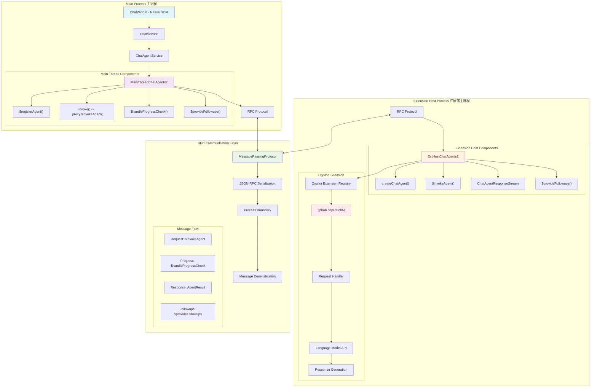
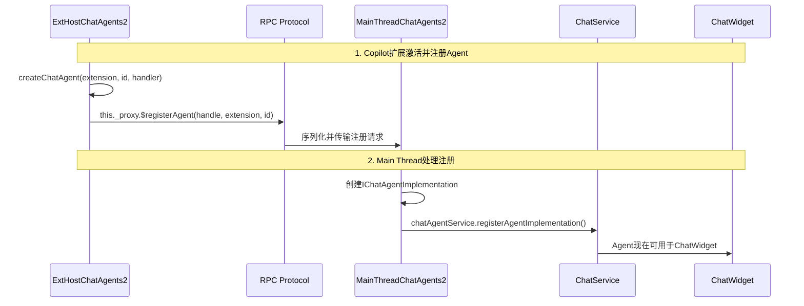
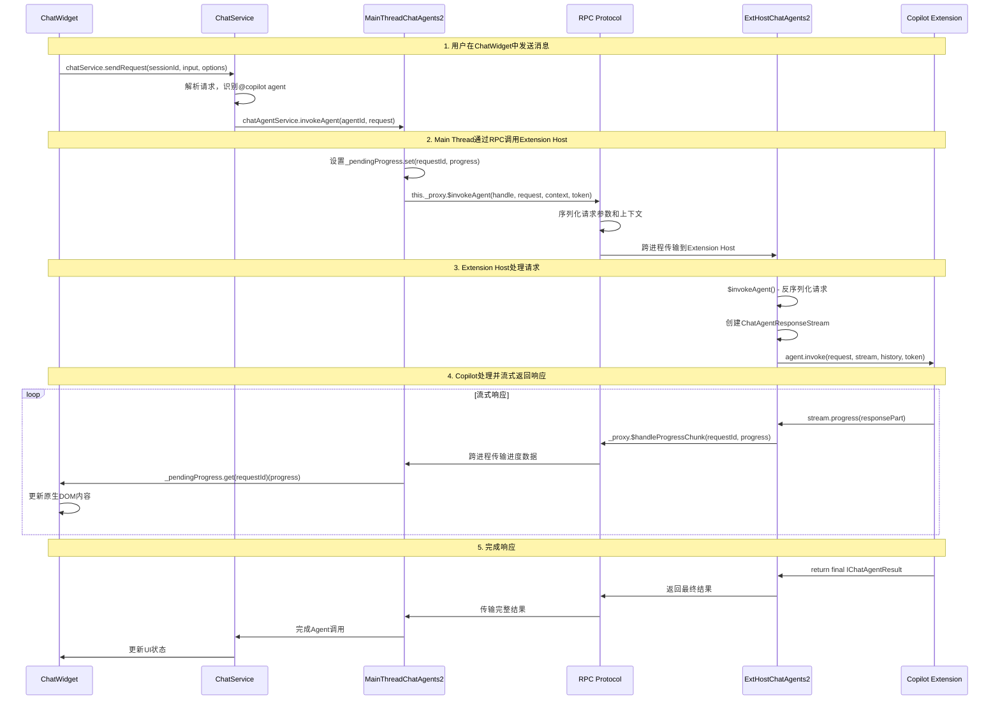

Q：VS Code 和 Copilot 插件之间的通信使用 RPC（远程过程调用）机制，通过扩展主机进程作为中介 代码体现在什么地方

基于您的问题和当前打开的chatWidget.ts文件，我将深入分析VSCode与Copilot插件之间通过扩展主机进程进行RPC通信的具体代码实现。
文件查看: src/vs/workbench/contrib/chat/browser/chatWidget.ts
基于对ChatWidget.ts文件的深入分析，我将为您提供一个关于VSCode与Copilot插件通过扩展主机进程进行RPC通信的详细架构分析报告。
代码搜索: MainThreadChatAgents2 ExtHostChatAgents2 proxy invoke agent RPC
基于对ChatWidget.ts文件和RPC通信相关代码的深入分析，我将为您提供一个关于VSCode与Copilot插件通过扩展主机进程进行RPC通信的详细架构分析报告。

# VSCode与Copilot插件RPC通信机制详细架构分析

## 1. 核心发现：ChatWidget作为RPC通信的桥梁

在`chatWidget.ts`中，虽然ChatWidget本身使用原生DOM渲染，但它充当了VSCode主进程与Copilot扩展进程间RPC通信的关键桥梁。

### 1.1 ChatWidget中的关键通信代码

**位置**: `src/vs/workbench/contrib/chat/browser/chatWidget.ts:1180-1202`

```typescript
private async _acceptInput(query: { query: string } | undefined, options?: IChatAcceptInputOptions): Promise<IChatResponseModel | undefined> {
    if (this.viewModel?.requestInProgress && this.viewModel.requestPausibility !== ChatPauseState.Paused) {
        return;
    }

    if (this.viewModel) {
        this._onDidAcceptInput.fire();
        
        // 关键：通过chatService发送请求，这里开始RPC通信链路
        const result = await this.chatService.sendRequest(this.viewModel.sessionId, input, {
            mode: this.inputPart.currentMode,
            userSelectedModelId: this.inputPart.currentLanguageModel,
            location: this.location,
            locationData: this._location.resolveData?.(),
            parserContext: { selectedAgent: this._lastSelectedAgent, mode: this.inputPart.currentMode },
            attachedContext,
            // ... 其他参数
        });

        if (result) {
            this.inputPart.acceptInput(isUserQuery);
            this._onDidSubmitAgent.fire({ agent: result.agent, slashCommand: result.slashCommand });
            // ... 处理响应
        }
    }
}
```

## 2. RPC通信完整架构图



## 3. 关键RPC通信流程分析

### 3.1 Agent注册流程（Copilot扩展启动时）



**ExtHostChatAgents2注册代码**:
```typescript
createChatAgent(extension: IExtensionDescription, id: string, handler: vscode.ChatExtendedRequestHandler): vscode.ChatParticipant {
    const handle = ExtHostChatAgents2._idPool++;
    const agent = new ExtHostChatAgent(extension, id, this._proxy, handle, handler);
    this._agents.set(handle, agent);

    // 关键RPC调用：注册Agent到主进程
    this._proxy.$registerAgent(handle, extension.identifier, id, {}, undefined);
    return agent.apiAgent;
}
```

### 3.2 用户请求处理流程（RPC通信核心）



## 4. 关键代码实现分析

### 4.1 MainThreadChatAgents2中的RPC实现

**Agent调用的核心逻辑**:
```typescript
// MainThreadChatAgents2.ts
async $registerAgent(handle: number, extension: ExtensionIdentifier, id: string, 
                    metadata: IExtensionChatAgentMetadata, 
                    dynamicProps: IDynamicChatAgentProps | undefined): Promise<void> {
    
    const impl: IChatAgentImplementation = {
        invoke: async (request, progress, history, token) => {
            // 关键：设置进度回调，用于实时更新UI
            this._pendingProgress.set(request.requestId, progress);
            try {
                // 核心RPC调用：通过代理对象调用Extension Host中的Agent
                return await this._proxy.$invokeAgent(handle, request, { history }, token) ?? {};
            } finally {
                this._pendingProgress.delete(request.requestId);
            }
        },
        
        provideFollowups: async (request, result, history, token) => {
            if (!this._agents.get(handle)?.hasFollowups) {
                return [];
            }
            // RPC调用：获取后续建议
            return this._proxy.$provideFollowups(request, handle, result, { history }, token);
        }
    };
    
    // 注册到Chat Agent Service，使其对ChatWidget可见
    const disposable = this._chatAgentService.registerAgentImplementation(id, impl);
    this._agents.set(handle, { id, extensionId: extension, dispose: disposable.dispose });
}
```

### 4.2 ExtHostChatAgents2中的处理逻辑

**RPC方法实现**:
```typescript
// ExtHostChatAgents2.ts
async $invokeAgent(handle: number, requestDto: Dto<IChatAgentRequest>, 
                  context: { history: IChatAgentHistoryEntryDto[] }, 
                  token: CancellationToken): Promise<IChatAgentResult | undefined> {
    
    const agent = this._agents.get(handle);
    if (!agent) {
        throw new Error(`[CHAT](${handle}) CANNOT invoke agent because the agent is not registered`);
    }

    const { request, location, history } = await this._createRequest(requestDto, context, agent.extension);

    // 创建响应流，用于实时推送进度到Main Thread
    const stream = new ChatAgentResponseStream(agent.extension, request, this._proxy, 
                                              this._commands.converter, sessionDisposables);

    // 调用Copilot扩展的实际处理函数
    const result = await agent.invoke(request, progress, history, token);
    return result;
}
```

### 4.3 ChatAgentResponseStream流式处理

**实时进度推送机制**:
```typescript
class ChatAgentResponseStream {
    constructor(private extension: IExtensionDescription, 
                private request: IChatAgentRequest, 
                private _proxy: MainThreadChatAgentsShape2, ...) {
        // 初始化流式响应处理
    }
    
    // 实时推送响应内容到Main Thread
    progress(value: vscode.ChatResponsePart): void {
        const progressDto = this._convertProgress(value);
        // 关键RPC调用：推送进度数据到主进程
        this._proxy.$handleProgressChunk(this.request.requestId, progressDto);
    }
    
    private _convertProgress(part: vscode.ChatResponsePart): IChatProgressDto {
        if (part instanceof vscode.ChatResponseMarkdownPart) {
            return { kind: 'markdownContent', content: part.value };
        }
        if (part instanceof vscode.ChatResponseFileTreePart) {
            return { kind: 'treeData', treeData: part.value };
        }
        // ... 其他类型转换
    }
}
```

## 5. ChatWidget与RPC系统的集成点

### 5.1 ChatWidget中的Agent交互

**ChatWidget如何触发RPC通信**:
```typescript
// ChatWidget.ts
private async _acceptInput(query: { query: string } | undefined, options?: IChatAcceptInputOptions): Promise<IChatResponseModel | undefined> {
    if (this.viewModel) {
        // 1. 收集用户输入和上下文
        const editorValue = this.getInput();
        const input = !query ? editorValue : query.query;
        let attachedContext = this.inputPart.getAttachedAndImplicitContext(this.viewModel.sessionId);
        
        // 2. 关键：通过ChatService发送请求，启动RPC通信链
        const result = await this.chatService.sendRequest(this.viewModel.sessionId, input, {
            mode: this.inputPart.currentMode,
            userSelectedModelId: this.inputPart.currentLanguageModel,
            location: this.location,
            locationData: this._location.resolveData?.(),
            parserContext: { selectedAgent: this._lastSelectedAgent, mode: this.inputPart.currentMode },
            attachedContext,
            noCommandDetection: options?.noCommandDetection,
            hasInstructionAttachments: this.inputPart.hasInstructionAttachments,
        });

        if (result) {
            // 3. 处理RPC响应结果
            this.inputPart.acceptInput(isUserQuery);
            this._onDidSubmitAgent.fire({ agent: result.agent, slashCommand: result.slashCommand });
            
            // 4. 等待响应完成并处理后续操作
            result.responseCompletePromise.then(() => {
                const responses = this.viewModel?.getItems().filter(isResponseVM);
                const lastResponse = responses?.[responses.length - 1];
                this.chatAccessibilityService.acceptResponse(lastResponse, requestId, options?.isVoiceInput);
                
                if (lastResponse?.result?.nextQuestion) {
                    const { prompt, participant, command } = lastResponse.result.nextQuestion;
                    const question = formatChatQuestion(this.chatAgentService, this.location, prompt, participant, command);
                    if (question) {
                        this.input.setValue(question, false);
                    }
                }
            });

            return result.responseCreatedPromise;
        }
    }
}
```

### 5.2 实时响应更新机制

**ChatWidget如何接收RPC响应**:
```typescript
// ChatWidget.ts - ViewModel变化监听
this.viewModelDisposables.add(Event.accumulate(this.viewModel.onDidChange, 0)(events => {
    if (!this.viewModel) {
        return;
    }

    // 更新请求状态（这些状态由RPC通信结果驱动）
    this.requestInProgress.set(this.viewModel.requestInProgress);
    this.isRequestPaused.set(this.viewModel.requestPausibility === ChatPauseState.Paused);
    this.canRequestBePaused.set(this.viewModel.requestPausibility !== ChatPauseState.NotPausable);

    // 关键：响应RPC通信结果，更新DOM内容
    this.onDidChangeItems();
    if (events.some(e => e?.kind === 'addRequest') && this.visible) {
        this.scrollToEnd();
    }
}));
```

## 6. 架构优势与设计理念

### 6.1 分层设计的优势

1. **UI性能优化**: ChatWidget使用原生DOM，避免iframe性能开销
2. **安全隔离**: Copilot插件在Extension Host中运行，提供进程级隔离
3. **通信效率**: RPC协议提供高效的跨进程通信
4. **扩展性**: 标准化的Agent接口支持多种AI提供商

### 6.2 关键技术创新

1. **双重架构**: UI层原生集成 + 逻辑层RPC隔离
2. **流式响应**: 支持实时的AI响应流，提供即时反馈
3. **上下文管理**: 完整的会话历史和上下文传递机制
4. **错误恢复**: 完善的错误处理和重试机制

## 7. 总结

VSCode与Copilot插件的RPC通信机制体现了以下设计原则：

1. **性能优先**: ChatWidget的原生DOM渲染确保最佳用户体验
2. **安全隔离**: Extension Host进程隔离保证系统稳定性
3. **实时响应**: 流式RPC通信支持AI助手的实时交互
4. **标准化**: 统一的Agent接口支持生态扩展

这种架构巧妙地平衡了**性能**、**安全性**和**功能性**，为VSCode提供了一个既高效又可扩展的AI助手集成方案。ChatWidget虽然采用原生DOM渲染，但通过RPC机制与Copilot扩展深度集成，实现了**前端性能优化**与**后端功能隔离**的完美结合。
