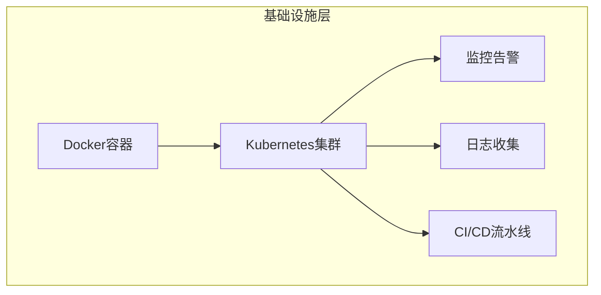

# Mermaid 图表演示
## 前端应用层与 API 网关层

```mermaid
graph TB
    subgraph "前端应用层"
        A[React Web应用] 
        B[Vue移动端]
        C[Flutter桌面应用]
        D[微信小程序]
    end
    
    subgraph "API网关层"
        E[Nginx负载均衡]
        F[API Gateway]
        G[身份认证服务]
        H[限流熔断器]
    end
    
    A --> E
    B --> E
    C --> E
    D --> E
    
    E --> F
    F --> G
    F --> H
## 微服务层与数据存储层

```mermaid
graph TB
    subgraph "微服务层"
        I[用户服务]
        J[订单服务] 
        K[支付服务]
        L[库存服务]
        M[推荐服务]
        N[分析服务]
        O[通知服务]
    end
    
    subgraph "数据存储层"
        P[(MySQL主库)]
        Q[(MySQL从库)]
        R[(Redis缓存)]
        S[(MongoDB文档)]
        T[(Elasticsearch)]
        U[文件存储OSS]
    end
    
    G --> I
    H --> J
    H --> K
    H --> L
    H --> M
    H --> N
    H --> O
    
    I --> P
    J --> P
    K --> P
    L --> P
    I --> R
    J --> R
    K --> R
    L --> R
    
    M --> S
    N --> T
    O --> U
    
    P --> Q
```
## 基础设施层



## 用户登录流程
sequenceDiagram
    participant U as 用户
    participant W as Web前端
    participant G as API网关
    participant A as 认证服务
    participant O as 订单服务
    participant P as 支付服务
    participant I as 库存服务
    participant N as 通知服务
    participant DB as 数据库
    participant C as 缓存
    participant MQ as 消息队列
    
    U->>W: 1. 登录请求
    W->>G: 2. 转发登录
    G->>A: 3. 验证用户
    A->>DB: 4. 查询用户信息
    DB-->>A: 5. 返回用户数据
    A-->>G: 6. 返回Token
    G-->>W: 7. 返回认证结果
    W-->>U: 8. 登录成功
    
    Note over U,MQ: 用户下单流程
    
    U->>W: 9. 创建订单
    W->>G: 10. 提交订单
    G->>A: 11. 验证Token
    A-->>G: 12. Token有效
    G->>O: 13. 创建订单
    
    O->>I: 14. 检查库存
    I->>DB: 15. 查询库存
    DB-->>I: 16. 库存充足
    I-->>O: 17. 库存确认
    
    O->>DB: 18. 保存订单
    O->>C: 19. 缓存订单
    O->>MQ: 20. 发送订单事件
    
    MQ->>P: 21. 支付处理
    P->>DB: 22. 创建支付记录
    P-->>O: 23. 支付结果
    
    MQ->>N: 24. 发送通知
    N->>U: 25. 推送通知
    
    O-->>G: 26. 返回订单结果
    G-->>W: 27. 返回响应
    W-->>U: 28. 显示订单成功
```

## 类图
classDiagram
    class User {
        +String id
        +String username
        +String email
        +String password
        +Date createdAt
        +login() Boolean
        +logout() void
        +updateProfile() void
    }
    
    class Order {
        +String id
        +String userId
        +OrderStatus status
        +Decimal totalAmount
        +Date createdAt
        +Date updatedAt
        +addItem(item: OrderItem) void
        +removeItem(itemId: String) void
        +calculateTotal() Decimal
        +updateStatus(status: OrderStatus) void
    }
    
    class OrderItem {
        +String id
        +String orderId
        +String productId
        +Integer quantity
        +Decimal unitPrice
        +Decimal subtotal
        +calculateSubtotal() Decimal
    }
    
    class Product {
        +String id
        +String name
        +String description
        +Decimal price
        +Integer stock
        +String category
        +Boolean isActive
        +updateStock(quantity: Integer) void
        +updatePrice(price: Decimal) void
    }
    
    class Payment {
        +String id
        +String orderId
        +PaymentMethod method
        +PaymentStatus status
        +Decimal amount
        +Date processedAt
        +process() Boolean
        +refund() Boolean
        +verify() Boolean
    }
    
    class Inventory {
        +String productId
        +Integer availableStock
        +Integer reservedStock
        +Integer totalStock
        +reserve(quantity: Integer) Boolean
        +release(quantity: Integer) void
        +updateStock(quantity: Integer) void
    }
    
    class Notification {
        +String id
        +String userId
        +NotificationType type
        +String title
        +String content
        +Boolean isRead
        +Date sentAt
        +send() void
        +markAsRead() void
    }
    
    User ||--o{ Order : "places"
    Order ||--o{ OrderItem : "contains"
    Product ||--o{ OrderItem : "ordered as"
    Order ||--|| Payment : "paid by"
    Product ||--|| Inventory : "tracked in"
    User ||--o{ Notification : "receives"
    Order ||--o{ Notification : "triggers"
    Payment ||--o{ Notification : "generates"
```

## 实体关系图
erDiagram
    USERS ||--o{ ORDERS : "places"
    USERS ||--o{ USER_PROFILES : "has"
    USERS ||--o{ NOTIFICATIONS : "receives"
    
    ORDERS ||--o{ ORDER_ITEMS : "contains"
    ORDERS ||--|| PAYMENTS : "paid_by"
    ORDERS ||--o{ ORDER_STATUS_HISTORY : "tracks"
    
    PRODUCTS ||--o{ ORDER_ITEMS : "ordered_in"
    PRODUCTS ||--|| INVENTORY : "tracked_in"
    PRODUCTS ||--o{ PRODUCT_CATEGORIES : "belongs_to"
    
    PAYMENTS ||--o{ PAYMENT_LOGS : "logged_in"
    
    USERS {
        string user_id PK
        string username UK
        string email UK
        string password_hash
        string phone
        datetime created_at
        datetime updated_at
        boolean is_active
        string role
    }
    
    USER_PROFILES {
        string user_id PK,FK
        string first_name
        string last_name
        date birth_date
        string avatar_url
        text bio
        string address
        string city
        string country
    }
    
    ORDERS {
        string order_id PK
        string user_id FK
        decimal total_amount
        string status
        string shipping_address
        datetime created_at
        datetime updated_at
        datetime shipped_at
        datetime delivered_at
    }
    
    ORDER_ITEMS {
        string order_id PK,FK
        string product_id PK,FK
        integer quantity
        decimal unit_price
        decimal subtotal
        datetime added_at
    }
    
    PRODUCTS {
        string product_id PK
        string name
        text description
        decimal price
        string sku UK
        string category_id FK
        boolean is_active
        datetime created_at
        datetime updated_at
        json attributes
    }
    
    INVENTORY {
        string product_id PK,FK
        integer available_stock
        integer reserved_stock
        integer total_stock
        integer reorder_point
        datetime last_updated
    }
    
    PAYMENTS {
        string payment_id PK
        string order_id FK
        string payment_method
        string status
        decimal amount
        string transaction_id
        datetime processed_at
        json gateway_response
    }
    
    NOTIFICATIONS {
        string notification_id PK
        string user_id FK
        string type
        string title
        text content
        boolean is_read
        datetime sent_at
        datetime read_at
    }
```

## 外部网络与内部架构
graph LR
    subgraph "外部网络"
        U[用户]
        CDN[CDN节点]
    end
    
    subgraph "DMZ区域"
        LB[负载均衡器]
        WAF[Web应用防火墙]
    end
    
    subgraph "应用服务器集群"
        subgraph "Web服务器"
            W1[Web-01]
            W2[Web-02] 
            W3[Web-03]
        end
        
        subgraph "API服务器"
            A1[API-01]
            A2[API-02]
            A3[API-03]
        end
        
        subgraph "微服务集群"
            M1[Service-01]
            M2[Service-02]
            M3[Service-03]
            M4[Service-04]
        end
    end
    
    subgraph "数据层"
        subgraph "数据库集群"
            DB1[(主数据库)]
            DB2[(从数据库-1)]
            DB3[(从数据库-2)]
        end
        
        subgraph "缓存集群"
            R1[(Redis-01)]
            R2[(Redis-02)]
            R3[(Redis-03)]
        end
        
        subgraph "存储服务"
            S1[文件存储]
            S2[备份存储]
        end
    end
    
    subgraph "监控运维"
        MON[监控中心]
        LOG[日志中心]
        CI[CI/CD]
    end
    
    U --> CDN
    CDN --> WAF
    WAF --> LB
    
    LB --> W1
    LB --> W2
    LB --> W3
    
    W1 --> A1
    W2 --> A2
    W3 --> A3
    
    A1 --> M1
    A1 --> M2
    A2 --> M3
    A3 --> M4
    
    M1 --> DB1
    M2 --> DB1
    M3 --> DB2
    M4 --> DB3
    
    DB1 --> DB2
    DB1 --> DB3
    
    M1 --> R1
    M2 --> R2
    M3 --> R3
    M4 --> R1
    
    M1 --> S1
    M2 --> S1
    M3 --> S2
    M4 --> S2
    
    MON --> W1
    MON --> W2
    MON --> W3
    MON --> A1
    MON --> A2
    MON --> A3
    
    LOG --> M1
    LOG --> M2
    LOG --> M3
    LOG --> M4
```