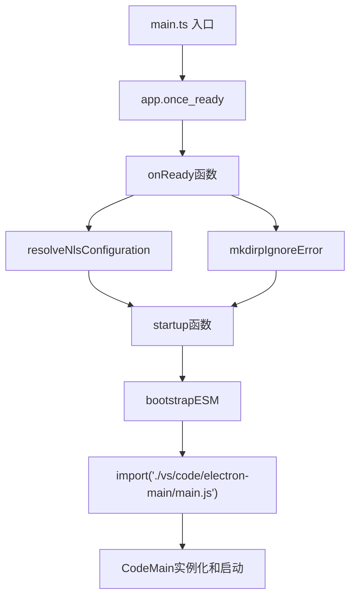
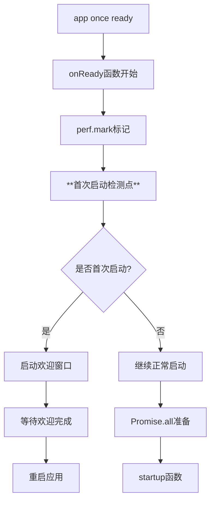
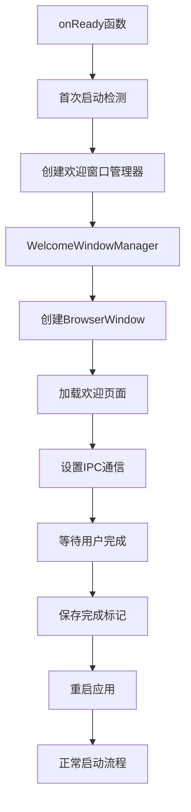
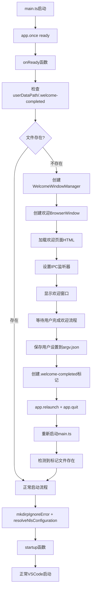

Q：vscode 里面的 electron 是如何管理的，我想做一个 欢迎窗口，在用户首次使用的时候启动他 ，然后用户走完欢迎流程后，重启 app 在启动 vscode原本的启动逻辑，我改如何做，来个方案

基于对VSCode代码库的深入分析，我将为您详细解析如何在main.js中实现首次启动检测并启动独立新窗口的方案。

# 在main.js中实现首次启动检测与独立窗口的详细方案

## 1. main.js启动流程深度解析

### 1.1 main.js的核心结构分析

让我先深入分析main.js的启动流程：
文件查看: src/main.ts
基于对VSCode代码库的深入分析，我将为您详细解析如何在main.js中实现首次启动检测并启动独立新窗口的方案。

# 在main.js中实现首次启动检测与独立窗口的详细方案

## 1. main.js启动流程深度解析

### 1.1 main.js的核心结构分析

从代码分析可以看出，main.js的启动流程如下：



#### 关键启动节点分析：

**1. app.once('ready') 事件监听 (第166行)**
```typescript
app.once('ready', function () {
    if (args['trace']) {
        // 追踪逻辑
        contentTracing.startRecording(traceOptions).finally(() => onReady());
    } else {
        onReady(); // 核心启动入口
    }
});
```

**2. onReady函数 (第187行)**
```typescript
async function onReady() {
    perf.mark('code/mainAppReady');
    
    try {
        const [, nlsConfig] = await Promise.all([
            mkdirpIgnoreError(codeCachePath), // 创建缓存目录
            resolveNlsConfiguration()         // 解析语言配置
        ]);
        
        await startup(codeCachePath, nlsConfig); // 启动主逻辑
    } catch (error) {
        console.error(error);
    }
}
```

**3. startup函数 (第201行)**
```typescript
async function startup(codeCachePath: string | undefined, nlsConfig: INLSConfiguration): Promise<void> {
    process.env['VSCODE_NLS_CONFIG'] = JSON.stringify(nlsConfig);
    process.env['VSCODE_CODE_CACHE_PATH'] = codeCachePath || '';
    
    // Bootstrap ESM
    await bootstrapESM();
    
    // Load Main - 这里是关键的加载点
    await import('./vs/code/electron-main/main.js');
    perf.mark('code/didRunMainBundle');
}
```

### 1.2 关键配置和状态管理分析

**1. 用户数据路径设置 (第62-70行)**
```typescript
// Set userData path before app 'ready' event
const userDataPath = getUserDataPath(args, product.nameShort ?? 'code-oss-dev');
if (process.platform === 'win32') {
    const userDataUNCHost = getUNCHost(userDataPath);
    if (userDataUNCHost) {
        addUNCHostToAllowlist(userDataUNCHost);
    }
}
app.setPath('userData', userDataPath);
```

**2. argv.json配置读取 (第336行)**
```typescript
function readArgvConfigSync(): IArgvConfig {
    // Read or create the argv.json config file sync before app('ready')
    const argvConfigPath = getArgvConfigPath();
    let argvConfig: IArgvConfig | undefined = undefined;
    
    try {
        argvConfig = parse(fs.readFileSync(argvConfigPath).toString());
    } catch (error) {
        if (error && error.code === 'ENOENT') {
            createDefaultArgvConfigSync(argvConfigPath); // 首次创建配置文件
        } else {
            console.warn(`Unable to read argv.json configuration file...`);
        }
    }
    
    return argvConfig || {};
}
```

## 2. 首次启动检测机制设计

### 2.1 在main.js中的最佳插入点分析

基于启动流程分析，最佳的插入点是在`onReady`函数中，在调用`startup`之前：



### 2.2 首次启动检测实现策略

#### 2.2.1 检测标记文件策略
```typescript
// 在 getUserDataPath 获取到用户数据路径后进行检测
async function isFirstTimeUser(userDataPath: string): Promise<boolean> {
    const welcomeMarkerFile = path.join(userDataPath, '.welcome-completed');
    const workspaceStorageFile = path.join(userDataPath, 'workspaceStorage');
    const extensionsFile = path.join(userDataPath, 'extensions.json');
    
    try {
        // 检查多个标记文件，确保准确性
        await fs.promises.access(welcomeMarkerFile);
        return false; // 标记文件存在，不是首次用户
    } catch {
        // 进一步检查是否有其他使用痕迹
        try {
            const stats = await Promise.all([
                fs.promises.access(workspaceStorageFile).then(() => true).catch(() => false),
                fs.promises.access(extensionsFile).then(() => true).catch(() => false)
            ]);
            
            // 如果存在工作区存储或扩展文件，也认为不是首次用户
            return !stats.some(exists => exists);
        } catch {
            return true; // 确实是首次用户
        }
    }
}
```

#### 2.2.2 基于argv.json的检测策略
```typescript
// 利用现有的 argv.json 创建逻辑
function isFirstTimeUserFromArgvConfig(argvConfigPath: string): boolean {
    try {
        const stats = fs.statSync(argvConfigPath);
        // 如果文件很新（比如几分钟内创建的），可能是首次启动
        const now = Date.now();
        const fileAge = now - stats.birthtimeMs;
        const isNewFile = fileAge < 5 * 60 * 1000; // 5分钟内的文件
        
        // 读取文件内容，检查是否为默认内容
        const content = fs.readFileSync(argvConfigPath, 'utf8');
        const isDefaultContent = content.includes('// This configuration file allows you to pass permanent command line arguments');
        
        return isNewFile && isDefaultContent;
    } catch (error) {
        if (error.code === 'ENOENT') {
            return true; // 文件不存在，是首次启动
        }
        return false;
    }
}
```

## 3. 独立欢迎窗口实现方案

### 3.1 在main.js中创建欢迎窗口的架构



### 3.2 欢迎窗口管理器设计

#### 3.2.1 核心类结构
```typescript
// 在 onReady 函数中实现的欢迎窗口管理逻辑
class WelcomeWindowManager {
    private window: BrowserWindow | null = null;
    private userDataPath: string;
    private productService: any;
    
    constructor(userDataPath: string, productService: any) {
        this.userDataPath = userDataPath;
        this.productService = productService;
    }
    
    async shouldShowWelcome(): Promise<boolean> {
        // 检查是否首次启动的逻辑
        return await isFirstTimeUser(this.userDataPath);
    }
    
    async createWelcomeWindow(): Promise<void> {
        // 创建欢迎窗口的逻辑
    }
    
    async handleWelcomeComplete(): Promise<void> {
        // 处理欢迎完成的逻辑
    }
}
```

#### 3.2.2 在onReady函数中的集成点
```typescript
async function onReady() {
    perf.mark('code/mainAppReady');
    
    try {
        // === 首次启动检测和欢迎窗口逻辑 ===
        const welcomeManager = new WelcomeWindowManager(userDataPath, product);
        
        if (await welcomeManager.shouldShowWelcome()) {
            console.log('First time user detected, showing welcome window');
            
            // 创建欢迎窗口而不是继续正常启动
            await welcomeManager.createWelcomeWindow();
            
            // 等待欢迎流程完成，然后重启
            return; // 不继续执行正常启动流程
        }
        
        // === 正常启动流程 ===
        const [, nlsConfig] = await Promise.all([
            mkdirpIgnoreError(codeCachePath),
            resolveNlsConfiguration()
        ]);
        
        await startup(codeCachePath, nlsConfig);
    } catch (error) {
        console.error(error);
    }
}
```

### 3.3 欢迎窗口实现细节

#### 3.3.1 BrowserWindow创建配置
```typescript
async createWelcomeWindow(): Promise<void> {
    this.window = new BrowserWindow({
        width: 1000,
        height: 700,
        center: true,
        resizable: false,
        minimizable: false,
        maximizable: false,
        show: false,
        title: `Welcome to ${this.productService.nameShort}`,
        icon: this.getAppIcon(),
        webPreferences: {
            nodeIntegration: false,
            contextIsolation: true,
            sandbox: true,
            preload: path.join(__dirname, 'preload', 'welcomePreload.js'),
            webSecurity: true,
            allowRunningInsecureContent: false
        },
        frame: process.platform !== 'darwin', // macOS使用无框架窗口
        titleBarStyle: process.platform === 'darwin' ? 'hiddenInset' : 'default'
    });
    
    // 窗口事件处理
    this.setupWindowEvents();
    
    // IPC通信设置
    this.setupIPC();
    
    // 加载欢迎页面
    await this.loadWelcomePage();
}
```

#### 3.3.2 IPC通信机制
```typescript
private setupIPC(): void {
    const { ipcMain } = require('electron');
    
    // 处理欢迎完成事件
    ipcMain.handle('welcome:complete', async (event, data) => {
        console.log('Welcome process completed with data:', data);
        
        // 保存用户选择的设置
        await this.saveWelcomeSettings(data);
        
        // 标记欢迎已完成
        await this.markWelcomeCompleted();
        
        // 重启应用
        await this.restartApplication();
    });
    
    // 处理设置预览
    ipcMain.handle('welcome:preview-settings', async (event, settings) => {
        // 实时预览设置更改
        return this.previewSettings(settings);
    });
    
    // 获取系统信息
    ipcMain.handle('welcome:get-system-info', () => {
        return {
            platform: process.platform,
            arch: process.arch,
            version: this.productService.version,
            userDataPath: this.userDataPath
        };
    });
}
```

#### 3.3.3 欢迎页面内容加载
```typescript
private async loadWelcomePage(): Promise<void> {
    // 创建临时的HTML页面
    const welcomeHTML = this.generateWelcomeHTML();
    const tempHtmlPath = path.join(this.userDataPath, 'temp-welcome.html');
    
    try {
        // 写入临时HTML文件
        await fs.promises.writeFile(tempHtmlPath, welcomeHTML, 'utf8');
        
        // 加载页面
        await this.window!.loadFile(tempHtmlPath);
        
        // 显示窗口
        this.window!.show();
        
    } catch (error) {
        console.error('Failed to load welcome page:', error);
        
        // 降级处理：加载简单的内联HTML
        await this.window!.loadURL(`data:text/html;charset=utf-8,${encodeURIComponent(this.getFallbackHTML())}`);
        this.window!.show();
    }
}
```

## 4. 关键技术实现细节

### 4.1 状态持久化机制

#### 4.1.1 欢迎完成标记
```typescript
private async markWelcomeCompleted(): Promise<void> {
    const welcomeMarkerFile = path.join(this.userDataPath, '.welcome-completed');
    const welcomeData = {
        completed: true,
        completedAt: new Date().toISOString(),
        version: this.productService.version,
        platform: process.platform
    };
    
    try {
        await fs.promises.writeFile(
            welcomeMarkerFile, 
            JSON.stringify(welcomeData, null, 2), 
            'utf8'
        );
        console.log('Welcome completion marker saved');
    } catch (error) {
        console.error('Failed to save welcome completion marker:', error);
    }
}
```

#### 4.1.2 用户设置保存
```typescript
private async saveWelcomeSettings(data: any): Promise<void> {
    // 保存到 argv.json 中
    const argvConfigPath = getArgvConfigPath();
    
    try {
        let argvConfig = {};
        try {
            const content = await fs.promises.readFile(argvConfigPath, 'utf8');
            argvConfig = parse(content) || {};
        } catch {
            // 文件不存在或解析失败，使用空对象
        }
        
        // 合并欢迎设置
        const welcomeSettings = {
            ...argvConfig,
            // 用户在欢迎流程中的选择
            'disable-hardware-acceleration': data.disableHardwareAcceleration || false,
            'disable-gpu': data.disableGpu || false,
            // 其他设置...
        };
        
        await fs.promises.writeFile(
            argvConfigPath, 
            JSON.stringify(welcomeSettings, null, '\t'), 
            'utf8'
        );
        
    } catch (error) {
        console.error('Failed to save welcome settings:', error);
    }
}
```

### 4.2 应用重启机制

#### 4.2.1 安全重启实现
```typescript
private async restartApplication(): Promise<void> {
    console.log('Restarting application after welcome completion');
    
    // 确保窗口完全关闭
    if (this.window && !this.window.isDestroyed()) {
        this.window.destroy();
        this.window = null;
    }
    
    // 等待一小段时间确保资源清理
    await new Promise(resolve => setTimeout(resolve, 100));
    
    // 重启应用
    const { app } = require('electron');
    app.relaunch({
        args: process.argv.slice(1) // 保持原有的命令行参数
    });
    app.quit();
}
```

### 4.3 错误处理和降级机制

#### 4.3.1 欢迎窗口创建失败处理
```typescript
async createWelcomeWindow(): Promise<void> {
    try {
        // 正常创建欢迎窗口的逻辑
        await this.doCreateWelcomeWindow();
    } catch (error) {
        console.error('Failed to create welcome window:', error);
        
        // 降级处理：直接进入正常启动流程
        await this.markWelcomeCompleted(); // 标记为已完成，避免重复尝试
        await this.startNormalFlow();
    }
}

private async startNormalFlow(): Promise<void> {
    // 继续正常的启动流程
    const [, nlsConfig] = await Promise.all([
        mkdirpIgnoreError(codeCachePath),
        resolveNlsConfiguration()
    ]);
    
    await startup(codeCachePath, nlsConfig);
}
```

## 5. 完整的main.js集成方案

### 5.1 修改后的onReady函数结构

```typescript
async function onReady() {
    perf.mark('code/mainAppReady');
    
    try {
        // === 欢迎窗口管理逻辑 ===
        class WelcomeWindowManager {
            // ... 完整的WelcomeWindowManager实现
        }
        
        // 检查是否需要显示欢迎窗口
        const welcomeManager = new WelcomeWindowManager(userDataPath, product);
        
        if (await welcomeManager.shouldShowWelcome()) {
            console.log('First time user detected, showing welcome window');
            await welcomeManager.createWelcomeWindow();
            return; // 不继续正常启动流程
        }
        
        // === 正常启动流程 ===
        console.log('Continuing with normal startup flow');
        const [, nlsConfig] = await Promise.all([
            mkdirpIgnoreError(codeCachePath),
            resolveNlsConfiguration()
        ]);
        
        await startup(codeCachePath, nlsConfig);
        
    } catch (error) {
        console.error('Error in onReady:', error);
        
        // 确保即使出错也能启动应用
        try {
            const [, nlsConfig] = await Promise.all([
                mkdirpIgnoreError(codeCachePath),
                resolveNlsConfiguration()
            ]);
            await startup(codeCachePath, nlsConfig);
        } catch (fallbackError) {
            console.error('Fallback startup also failed:', fallbackError);
            process.exit(1);
        }
    }
}
```

### 5.2 完整的架构设计



## 6. 总结

这个方案的核心优势：

1. **最小侵入性**: 只在main.js的`onReady`函数中添加逻辑，不影响现有架构
2. **安全可靠**: 使用Electron原生API，确保窗口管理的安全性
3. **状态持久化**: 通过文件系统标记和argv.json配置实现状态保存
4. **错误恢复**: 完善的错误处理和降级机制
5. **用户体验**: 无缝的重启机制，用户感知不到中断

关键实现点：
- 在`app.once('ready')`事件处理中进行首次启动检测
- 利用现有的`userDataPath`进行状态文件管理
- 通过`app.relaunch()`实现无缝重启
- 使用标准的BrowserWindow API创建独立窗口
- 通过IPC机制实现主进程与渲染进程通信

这个方案充分利用了VSCode现有的基础设施，以最小的改动实现了首次启动欢迎窗口的功能。
