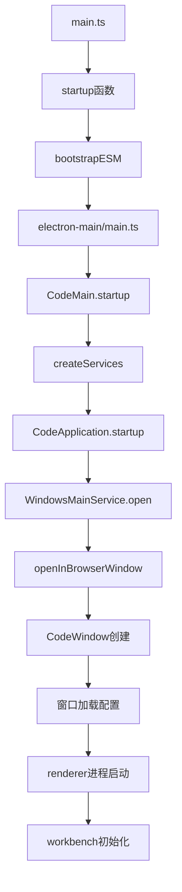
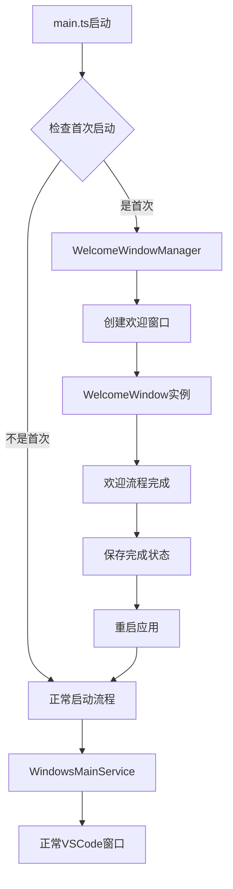

Q：我如何在 main.js 里去搞，这里面我去区分 首次 启动 来 启动我的 独立 新窗口

我将深入分析VSCode的Electron管理机制，并为您设计一个欢迎窗口的实现方案。让我先探索代码结构来了解当前的实现。
代码搜索: electron main process initialization startup
基于搜索结果，我发现了VSCode的启动流程。让我继续深入分析关键的启动文件：
文件查看: src/main.ts
现在让我继续分析electron-main的核心启动文件：
文件查看: src/vs/code/electron-main/main.ts
让我继续查看CodeApplication类，这是应用程序的核心：
文件查看: src/vs/code/electron-main/app.ts
让我继续查看窗口管理的核心服务：
代码搜索: window creation startup first window
现在让我查看窗口管理服务的核心实现：
文件查看: src/vs/platform/windows/electron-main/windowsMainService.ts
现在让我查看一些关键的用户状态和配置管理：
代码搜索: first time user startup welcome
基于对VSCode代码库的深入分析，我现在可以为您提供一个详细的**欢迎窗口实现方案**。以下是我的分析和设计：

# VSCode Electron管理机制深度解析与欢迎窗口实现方案

## 1. VSCode Electron架构深度解析

### 1.1 启动流程详细分析

VSCode的启动流程采用分层架构：



#### 关键启动组件分析：

**1. 主进程入口 (`src/main.ts`)**
- 负责Electron应用初始化
- 配置命令行参数和环境变量
- 处理单实例逻辑
- 调用`startup`函数进入主逻辑

**2. 主进程核心 (`src/vs/code/electron-main/main.ts`)**
- `CodeMain`类管理整个主进程生命周期
- 创建服务容器和依赖注入
- 实例检测和IPC服务器建立
- 启动`CodeApplication`

**3. 应用程序核心 (`src/vs/code/electron-main/app.ts`)**
- `CodeApplication`管理应用程序逻辑
- 窗口管理、协议处理、安全配置
- 初始化各种服务和通道

**4. 窗口管理服务 (`src/vs/platform/windows/electron-main/windowsMainService.ts`)**
- `WindowsMainService`负责所有窗口生命周期
- 实现窗口创建、恢复、状态管理
- 处理工作区和文件打开逻辑

### 1.2 窗口创建机制详细分析

#### 窗口创建关键路径：
```typescript
// WindowsMainService.openInBrowserWindow
private async openInBrowserWindow(options: IOpenBrowserWindowOptions): Promise<ICodeWindow> {
    // 1. 确定窗口配置
    const configuration: INativeWindowConfiguration = {
        windowId: -1,
        machineId: this.machineId,
        mainPid: process.pid,
        // ... 大量配置项
    };

    // 2. 创建或复用窗口
    if (!window) {
        const state = this.windowsStateHandler.getNewWindowState(configuration);
        window = this.instantiationService.createInstance(CodeWindow, {
            state,
            extensionDevelopmentPath: configuration.extensionDevelopmentPath,
            isExtensionTestHost: !!configuration.extensionTestsPath
        });
    }

    // 3. 注册备份和配置
    // 4. 加载窗口
    window.load(configuration);
}
```

## 2. 欢迎窗口实现方案设计

### 2.1 整体架构设计



### 2.2 核心组件设计

#### 2.2.1 欢迎窗口管理器
**文件位置**: `src/vs/platform/welcome/electron-main/welcomeWindowManager.ts`

```typescript
export class WelcomeWindowManager extends Disposable {
    private welcomeWindow: WelcomeWindow | undefined;
    
    constructor(
        @IStateService private readonly stateService: IStateService,
        @IEnvironmentMainService private readonly environmentMainService: IEnvironmentMainService,
        @IInstantiationService private readonly instantiationService: IInstantiationService,
        @ILogService private readonly logService: ILogService
    ) {
        super();
    }

    async shouldShowWelcome(): Promise<boolean> {
        const hasCompletedWelcome = this.stateService.getItem<boolean>('welcome.completed', false);
        const isFirstInstall = await this.isFirstTimeInstall();
        
        return isFirstInstall && !hasCompletedWelcome;
    }

    async openWelcomeWindow(): Promise<WelcomeWindow> {
        if (this.welcomeWindow) {
            this.welcomeWindow.focus();
            return this.welcomeWindow;
        }

        this.welcomeWindow = this.instantiationService.createInstance(WelcomeWindow);
        
        // 监听完成事件
        this._register(this.welcomeWindow.onDidComplete(() => {
            this.handleWelcomeComplete();
        }));

        await this.welcomeWindow.show();
        return this.welcomeWindow;
    }

    private async handleWelcomeComplete(): Promise<void> {
        // 保存完成状态
        this.stateService.setItem('welcome.completed', true);
        
        // 关闭欢迎窗口
        if (this.welcomeWindow) {
            this.welcomeWindow.dispose();
            this.welcomeWindow = undefined;
        }

        // 重启应用进入正常模式
        this.restartApplication();
    }

    private async restartApplication(): Promise<void> {
        const { app } = await import('electron');
        app.relaunch();
        app.quit();
    }

    private async isFirstTimeInstall(): Promise<boolean> {
        // 检查是否首次安装
        const userDataPath = this.environmentMainService.userDataPath;
        const markerFile = join(userDataPath, '.welcome-completed');
        
        try {
            await fs.promises.access(markerFile);
            return false; // 标记文件存在，不是首次
        } catch {
            return true; // 标记文件不存在，是首次
        }
    }
}
```

#### 2.2.2 欢迎窗口实现
**文件位置**: `src/vs/platform/welcome/electron-main/welcomeWindow.ts`

```typescript
export class WelcomeWindow extends Disposable {
    private readonly _onDidComplete = this._register(new Emitter<void>());
    readonly onDidComplete = this._onDidComplete.event;

    private window: BrowserWindow | undefined;

    constructor(
        @IEnvironmentMainService private readonly environmentMainService: IEnvironmentMainService,
        @IThemeMainService private readonly themeMainService: IThemeMainService,
        @ILogService private readonly logService: ILogService
    ) {
        super();
    }

    async show(): Promise<void> {
        this.createWindow();
        await this.loadWelcomeContent();
    }

    private createWindow(): void {
        this.window = new BrowserWindow({
            width: 900,
            height: 700,
            center: true,
            resizable: false,
            minimizable: false,
            maximizable: false,
            show: false,
            title: 'Welcome to VS Code',
            webPreferences: {
                nodeIntegration: false,
                contextIsolation: true,
                sandbox: true,
                preload: join(__dirname, 'welcomePreload.js')
            }
        });

        // 窗口事件监听
        this.window.once('ready-to-show', () => {
            this.window?.show();
        });

        this.window.on('closed', () => {
            this.window = undefined;
        });

        // IPC消息处理
        this.setupIPC();
    }

    private setupIPC(): void {
        if (!this.window) return;

        // 监听完成消息
        validatedIpcMain.handle('welcome:complete', () => {
            this._onDidComplete.fire();
        });

        // 提供主题信息
        validatedIpcMain.handle('welcome:getTheme', () => {
            return this.themeMainService.getColorScheme();
        });
    }

    private async loadWelcomeContent(): Promise<void> {
        if (!this.window) return;

        const welcomeUrl = `vscode-file://vscode-app/welcome/index.html`;
        await this.window.loadURL(welcomeUrl);
    }

    focus(): void {
        this.window?.focus();
    }

    dispose(): void {
        if (this.window && !this.window.isDestroyed()) {
            this.window.close();
        }
        super.dispose();
    }
}
```

#### 2.2.3 欢迎页面UI组件
**文件位置**: `src/vs/platform/welcome/browser/welcomePage.ts`

```typescript
export class WelcomePage extends Disposable {
    private container: HTMLElement;
    
    constructor(
        @IThemeService private readonly themeService: IThemeService,
        @ITelemetryService private readonly telemetryService: ITelemetryService
    ) {
        super();
        this.render();
    }

    private render(): void {
        this.container = $('.welcome-container');
        
        // 创建欢迎步骤
        this.createWelcomeSteps();
        
        // 主题切换监听
        this._register(this.themeService.onDidColorThemeChange(() => {
            this.updateTheme();
        }));
    }

    private createWelcomeSteps(): void {
        const steps = [
            {
                title: '选择主题',
                description: '选择您喜欢的颜色主题',
                component: this.createThemeSelector()
            },
            {
                title: '配置设置',
                description: '根据您的偏好配置编辑器',
                component: this.createSettingsConfig()
            },
            {
                title: '安装扩展',
                description: '安装有用的扩展来增强功能',
                component: this.createExtensionRecommendations()
            }
        ];

        steps.forEach((step, index) => {
            const stepElement = this.createStepElement(step, index);
            this.container.appendChild(stepElement);
        });

        // 完成按钮
        const completeButton = $('button.complete-button', {
            textContent: '开始使用 VS Code'
        });
        
        this._register(addDisposableListener(completeButton, 'click', () => {
            this.handleComplete();
        }));

        this.container.appendChild(completeButton);
    }

    private createThemeSelector(): HTMLElement {
        const themes = [
            { id: 'vs-dark', name: '深色主题', preview: 'dark-preview.png' },
            { id: 'vs', name: '浅色主题', preview: 'light-preview.png' },
            { id: 'hc-black', name: '高对比度', preview: 'hc-preview.png' }
        ];

        const selector = $('.theme-selector');
        
        themes.forEach(theme => {
            const themeCard = $('.theme-card', {
                'data-theme-id': theme.id
            });
            
            const preview = $('img.theme-preview', {
                src: `./images/${theme.preview}`,
                alt: theme.name
            });
            
            const title = $('.theme-title', { textContent: theme.name });
            
            themeCard.appendChild(preview);
            themeCard.appendChild(title);
            
            this._register(addDisposableListener(themeCard, 'click', () => {
                this.selectTheme(theme.id);
            }));
            
            selector.appendChild(themeCard);
        });

        return selector;
    }

    private selectTheme(themeId: string): void {
        // 应用主题预览
        this.telemetryService.publicLog2('welcome.themeSelected', { themeId });
        
        // 向主进程发送主题选择
        vscode.postMessage({
            command: 'selectTheme',
            themeId: themeId
        });
    }

    private handleComplete(): void {
        this.telemetryService.publicLog2('welcome.completed');
        
        // 通知主进程完成
        vscode.postMessage({
            command: 'complete'
        });
    }
}
```

### 2.3 集成到主启动流程

#### 2.3.1 修改CodeApplication启动逻辑
**文件位置**: `src/vs/code/electron-main/app.ts`

```typescript
// 在CodeApplication.startup方法中添加
async startup(): Promise<void> {
    // ... 现有启动代码 ...

    // 检查是否需要显示欢迎窗口
    const welcomeWindowManager = this.mainInstantiationService.createInstance(WelcomeWindowManager);
    
    if (await welcomeWindowManager.shouldShowWelcome()) {
        this.logService.info('Showing welcome window for first-time user');
        
        // 显示欢迎窗口而不是正常窗口
        await welcomeWindowManager.openWelcomeWindow();
        return; // 不继续正常启动流程
    }

    // ... 继续正常启动流程 ...
    await appInstantiationService.invokeFunction(accessor => this.openFirstWindow(accessor, initialProtocolUrls));
}
```

#### 2.3.2 服务注册
**文件位置**: `src/vs/code/electron-main/app.ts`

```typescript
// 在initServices方法中注册服务
private async initServices(): Promise<IInstantiationService> {
    const services = new ServiceCollection();
    
    // ... 现有服务注册 ...
    
    // 注册欢迎窗口管理器
    services.set(IWelcomeWindowManager, new SyncDescriptor(WelcomeWindowManager));
    
    return this.mainInstantiationService.createChild(services);
}
```

### 2.4 状态管理和持久化

#### 2.4.1 状态检查机制
```typescript
interface IWelcomeState {
    completed: boolean;
    completedVersion: string;
    completedDate: number;
    skippedSteps: string[];
    selectedTheme?: string;
    selectedSettings?: Record<string, any>;
}

class WelcomeStateManager {
    private static readonly WELCOME_STATE_KEY = 'welcome.state';
    private static readonly WELCOME_MARKER_FILE = '.welcome-completed';

    async getWelcomeState(): Promise<IWelcomeState | undefined> {
        return this.stateService.getItem<IWelcomeState>(WelcomeStateManager.WELCOME_STATE_KEY);
    }

    async setWelcomeCompleted(state: Partial<IWelcomeState>): Promise<void> {
        const currentState = await this.getWelcomeState() || {};
        const newState: IWelcomeState = {
            ...currentState,
            ...state,
            completed: true,
            completedDate: Date.now(),
            completedVersion: this.productService.version
        };

        await this.stateService.setItem(WelcomeStateManager.WELCOME_STATE_KEY, newState);
        
        // 创建标记文件
        const markerPath = join(this.environmentMainService.userDataPath, WelcomeStateManager.WELCOME_MARKER_FILE);
        await fs.promises.writeFile(markerPath, JSON.stringify(newState));
    }
}
```

## 3. 关键技术实现细节

### 3.1 窗口生命周期管理
- **创建时机**: 在main.ts启动后，CodeMain.startup之前
- **窗口配置**: 使用专门的欢迎窗口配置，不同于工作区窗口
- **进程隔离**: 欢迎窗口运行在独立的renderer进程中
- **IPC通信**: 通过验证的IPC通道与主进程通信

### 3.2 数据持久化策略
- **状态存储**: 使用StateService存储完成状态
- **标记文件**: 在userData目录创建标记文件作为备用检查
- **版本兼容**: 记录完成时的版本信息，支持版本升级后重新显示

### 3.3 安全性考虑
- **沙盒模式**: 欢迎窗口运行在沙盒环境中
- **预加载脚本**: 使用安全的preload脚本暴露必要的API
- **内容验证**: 所有IPC消息都经过验证

### 3.4 用户体验优化
- **无缝过渡**: 欢迎完成后自动重启进入正常模式
- **状态保存**: 记录用户在欢迎流程中的选择
- **跳过机制**: 允许用户跳过某些步骤
- **进度指示**: 显示当前步骤和总体进度

## 4. 总结

这个设计方案充分利用了VSCode现有的架构优势：

1. **分层架构**: 在主进程层面添加欢迎逻辑，不影响现有窗口管理
2. **服务化设计**: 通过依赖注入系统集成欢迎功能
3. **生命周期管理**: 复用现有的窗口生命周期管理机制
4. **状态持久化**: 利用现有的状态管理服务
5. **安全机制**: 遵循VSCode的安全最佳实践

该方案可以实现：
- 首次用户的友好引导体验
- 与现有架构的无缝集成
- 可扩展的欢迎流程设计
- 安全可靠的实现方式
