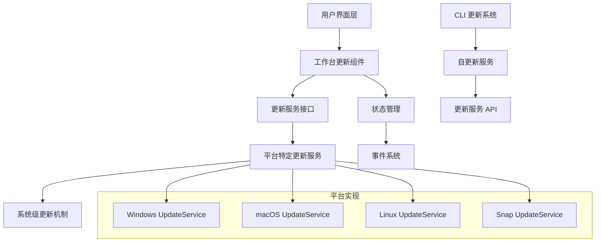
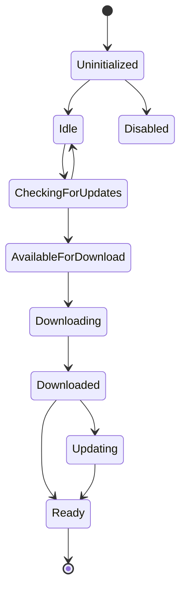

Q：介绍下自动更新的过程

我将对 VSCode 的自动更新机制进行深度分析。首先让我搜索和了解相关的更新代码实现。
代码搜索: auto update mechanism update process
让我继续搜索更多更新相关的代码：
代码搜索: updateService updateManager electron update
让我搜索更多核心的更新服务和状态管理相关代码：
代码搜索: AbstractUpdateService State updateService
现在让我搜索具体的更新状态定义和更新流程：
代码搜索: StateType update state enum
现在让我读取核心的更新服务抽象类文件：
文件查看: src/vs/platform/update/electron-main/abstractUpdateService.ts
现在让我查看具体的平台实现，先看 Windows 的更新服务：
文件查看: src/vs/platform/update/electron-main/updateService.win32.ts
现在让我查看 macOS 的更新服务实现：
文件查看: src/vs/platform/update/electron-main/updateService.darwin.ts
现在让我查看更新状态定义和接口：
文件查看: src/vs/platform/update/common/update.ts
现在让我查看工作台中的更新UI实现：
文件查看: src/vs/workbench/contrib/update/browser/update.ts
现在让我查看 CLI 端的更新实现，特别是 Rust 部分：
文件查看: cli/src/update_service.rs
现在让我查看自动更新相关的核心实现：
文件查看: cli/src/update_service/self_update.rs
Error reading file:
File not found: /Users/zhouhongxuan/program/repos/vscode/cli/src/update_service/self_update.rs
让我查找 CLI 中的更新相关目录结构：
文件列表查询: cli/src
现在让我查看 CLI 的自动更新实现：
文件查看: cli/src/self_update.rs
基于对 VSCode 代码库的深度分析，我将为您详细介绍 VSCode 的自动更新机制。

# VSCode 自动更新机制深度解析

## 1. 整体架构设计

VSCode 的自动更新系统采用**分层架构**设计，包含以下核心层级：



## 2. 核心组件分析

### 2.1 更新状态机

VSCode 使用严格的状态机管理更新流程：

```typescript
const enum StateType {
    Uninitialized = 'uninitialized',
    Idle = 'idle',
    Disabled = 'disabled',
    CheckingForUpdates = 'checking for updates',
    AvailableForDownload = 'available for download',
    Downloading = 'downloading',
    Downloaded = 'downloaded',
    Updating = 'updating',
    Ready = 'ready',
}
```

**状态转换流程：**


### 2.2 AbstractUpdateService 抽象基类

位于 `src/vs/platform/update/electron-main/abstractUpdateService.ts`，这是所有平台更新服务的基础：

**核心功能：**
- **初始化检查**：验证构建状态、环境配置、更新URL等
- **定时检查**：实现递归的更新检查调度
- **状态管理**：维护更新状态并触发事件
- **配置处理**：解析用户更新偏好设置

**关键实现细节：**
```typescript
protected async initialize(): Promise<void> {
    // 1. 检查是否为源码构建
    if (!this.environmentMainService.isBuilt) {
        this.setState(State.Disabled(DisablementReason.NotBuilt));
        return;
    }
    
    // 2. 检查环境禁用标志
    if (this.environmentMainService.disableUpdates) {
        this.setState(State.Disabled(DisablementReason.DisabledByEnvironment));
        return;
    }
    
    // 3. 验证更新配置
    if (!this.productService.updateUrl || !this.productService.commit) {
        this.setState(State.Disabled(DisablementReason.MissingConfiguration));
        return;
    }
    
    // 4. 处理用户更新模式设置
    const updateMode = this.configurationService.getValue<'none' | 'manual' | 'start' | 'default'>('update.mode');
    
    // 5. 启动自动检查机制
    if (updateMode === 'start') {
        setTimeout(() => this.checkForUpdates(false), 30 * 1000);
    } else {
        this.scheduleCheckForUpdates(30 * 1000);
    }
}
```

## 3. 平台特定实现

### 3.1 Windows 更新服务

位于 `src/vs/platform/update/electron-main/updateService.win32.ts`

**关键特性：**
- **双更新类型支持**：Setup 安装包和 Archive 归档包
- **后台快速更新**：用户版本支持静默后台安装
- **管理员检测**：防止用户版本在管理员模式下运行时的更新问题

**下载和安装流程：**
```typescript
protected doCheckForUpdates(context: any): void {
    // 1. 请求更新信息
    this.requestService.request({ url: this.url }, CancellationToken.None)
        .then<IUpdate | null>(asJson)
        .then(update => {
            // 2. 验证更新信息
            if (!update || !update.url || !update.version) {
                this.setState(State.Idle(updateType));
                return;
            }
            
            // 3. 对于 Archive 类型，仅显示下载提示
            if (updateType === UpdateType.Archive) {
                this.setState(State.AvailableForDownload(update));
                return;
            }
            
            // 4. Setup 类型自动下载
            this.setState(State.Downloading);
            return this.downloadAndPrepareUpdate(update);
        });
}
```

**后台更新机制：**
```typescript
protected override async doApplyUpdate(): Promise<void> {
    // 1. 创建更新标志文件
    this.availableUpdate.updateFilePath = path.join(cachePath, 
        `CodeSetup-${this.productService.quality}-${update.version}.flag`);
    
    // 2. 启动静默安装程序
    const child = spawn(this.availableUpdate.packagePath, [
        '/verysilent', '/log', 
        `/update="${this.availableUpdate.updateFilePath}"`, 
        '/nocloseapplications', 
        '/mergetasks=runcode,!desktopicon,!quicklaunchicon'
    ], {
        detached: true,
        stdio: ['ignore', 'ignore', 'ignore'],
        windowsVerbatimArguments: true
    });
    
    // 3. 监控安装完成状态
    const readyMutexName = `${this.productService.win32MutexName}-ready`;
    pollUntil(() => mutex.isActive(readyMutexName))
        .then(() => this.setState(State.Ready(update)));
}
```

### 3.2 macOS 更新服务

位于 `src/vs/platform/update/electron-main/updateService.darwin.ts`

**特点：**
- **Electron AutoUpdater 集成**：直接使用 Electron 的自动更新器
- **签名验证**：自动处理应用签名验证
- **通用二进制支持**：支持 Intel 和 Apple Silicon

**实现核心：**
```typescript
protected buildUpdateFeedUrl(quality: string): string | undefined {
    let assetID: string;
    if (!this.productService.darwinUniversalAssetId) {
        assetID = process.arch === 'x64' ? 'darwin' : 'darwin-arm64';
    } else {
        assetID = this.productService.darwinUniversalAssetId;
    }
    
    const url = createUpdateURL(assetID, quality, this.productService);
    try {
        electron.autoUpdater.setFeedURL({ url });
        return url;
    } catch (e) {
        // 应用可能未签名
        this.logService.error('Failed to set update feed URL', e);
        return undefined;
    }
}
```

## 4. CLI 自动更新系统

### 4.1 Rust 实现的自更新

位于 `cli/src/self_update.rs`，提供 CLI 工具的自更新能力：

**核心流程：**
```rust
pub async fn do_update(
    &self,
    release: &Release,
    progress: impl ReportCopyProgress,
) -> Result<(), AnyError> {
    // 1. 下载更新到临时目录
    let tempdir = tempdir()?;
    let stream = self.update_service.get_download_stream(release).await?;
    let archive_path = tempdir.path().join(stream.url_path_basename().unwrap());
    http::download_into_file(&archive_path, progress, stream).await?;
    
    // 2. 解压并验证新二进制文件
    let target_path = std::env::current_exe()?;
    let staging_path = target_path.with_extension(".update");
    unzip_downloaded_release(&archive_path, &archive_contents_path, SilentCopyProgress())?;
    copy_updated_cli_to_path(&archive_contents_path, &staging_path)?;
    
    // 3. 设置文件权限并验证可执行性
    copy_file_metadata(&target_path, &staging_path)?;
    validate_cli_is_good(&staging_path)?;
    
    // 4. 原子性替换旧版本
    fs::rename(&target_path, tempdir.path().join("old-code-cli")).or_else(|_| {
        fs::rename(&target_path, target_path.with_extension(OLD_UPDATE_EXTENSION))
    })?;
    
    fs::rename(&staging_path, &target_path)?;
    Ok(())
}
```

### 4.2 Web 服务器版本管理

位于 `cli/src/commands/serve_web.rs`，实现服务器版本的动态管理：

**版本检查器：**
```rust
pub fn start_update_checker(self: Arc<Self>, duration: Duration) {
    tokio::spawn(async move {
        let mut interval = time::interval(duration);
        loop {
            interval.tick().await;
            if let Err(e) = self.get_latest_release().await {
                warning!(self.log, "error getting latest version: {}", e);
            }
        }
    });
}
```

**并发版本下载：**
```rust
async fn download_version(
    args: StartArgs,
    update_service: UpdateService,
    cache: DownloadCache,
) {
    let dir_fut = cache.create(&args.release.commit, |target_dir| async move {
        let tmpdir = tempfile::tempdir().unwrap();
        let response = update_service.get_download_stream(&release_for_fut).await?;
        
        // 下载到临时文件
        let archive_path = tmpdir.path().join(response.url_path_basename().unwrap());
        http::download_into_file(&archive_path, log_for_fut.get_download_logger("Downloading server:"), response).await?;
        
        // 解压到目标目录
        unzip_downloaded_release(&archive_path, &target_dir, SilentCopyProgress())?;
        Ok(())
    });
}
```

## 5. 用户界面集成

### 5.1 工作台更新组件

位于 `src/vs/workbench/contrib/update/browser/update.ts`

**UI状态同步：**
```typescript
private async onUpdateStateChange(state: UpdateState): Promise<void> {
    this.updateStateContextKey.set(state.type);
    
    switch (state.type) {
        case StateType.AvailableForDownload:
            this.onUpdateAvailable(state.update);
            break;
        case StateType.Downloaded:
            this.onUpdateDownloaded(state.update);
            break;
        case StateType.Ready:
            this.onUpdateReady(state.update);
            break;
    }
    
    // 更新活动栏徽章
    let badge: IBadge | undefined = undefined;
    if (state.type === StateType.AvailableForDownload || 
        state.type === StateType.Downloaded || 
        state.type === StateType.Ready) {
        badge = new NumberBadge(1, () => nls.localize('updateIsReady', 
            "New {0} update available.", this.productService.nameShort));
    }
    
    if (badge) {
        this.badgeDisposable.value = this.activityService.showGlobalActivity({ badge });
    }
}
```

### 5.2 上下文感知的菜单系统

**动态菜单注册：**
```typescript
private registerGlobalActivityActions(): void {
    // 检查更新
    CommandsRegistry.registerCommand('update.check', () => this.updateService.checkForUpdates(true));
    MenuRegistry.appendMenuItem(MenuId.GlobalActivity, {
        group: '7_update',
        command: { id: 'update.check', title: nls.localize('checkForUpdates', "Check for Updates...") },
        when: CONTEXT_UPDATE_STATE.isEqualTo(StateType.Idle)
    });
    
    // 下载更新
    CommandsRegistry.registerCommand('update.downloadNow', () => this.updateService.downloadUpdate());
    MenuRegistry.appendMenuItem(MenuId.GlobalActivity, {
        group: '7_update',
        command: { id: 'update.downloadNow', title: nls.localize('download update_1', "Download Update (1)") },
        when: CONTEXT_UPDATE_STATE.isEqualTo(StateType.AvailableForDownload)
    });
    
    // 安装更新
    CommandsRegistry.registerCommand('update.install', () => this.updateService.applyUpdate());
    MenuRegistry.appendMenuItem(MenuId.GlobalActivity, {
        group: '7_update',
        command: { id: 'update.install', title: nls.localize('installUpdate...', "Install Update... (1)") },
        when: CONTEXT_UPDATE_STATE.isEqualTo(StateType.Downloaded)
    });
}
```

## 6. 关键设计特点

### 6.1 渐进式更新策略
- **分阶段通知**：根据平台和配置显示不同的更新提示
- **用户控制**：支持手动、启动时和自动更新模式
- **非侵入式**：更新过程不会强制中断用户工作流程

### 6.2 可靠性保障
- **原子性操作**：文件替换使用原子性重命名操作
- **回滚机制**：保留旧版本文件用于可能的回滚
- **完整性验证**：下载后验证文件完整性和可执行性

### 6.3 平台适配
- **Windows**：支持安装包和便携版，处理UAC和管理员权限
- **macOS**：集成系统原生更新机制，支持签名验证
- **Linux**：支持多种分发形式（Snap、AppImage、tar.gz）

### 6.4 性能优化
- **后台下载**：更新下载在后台进行，不影响用户使用
- **增量更新**：CLI 工具支持增量更新机制
- **缓存管理**：智能缓存管理避免重复下载

这套自动更新系统展现了 VSCode 在用户体验、系统可靠性和跨平台兼容性方面的卓越设计，通过状态机、事件驱动和分层架构的组合，实现了一个既强大又用户友好的自动更新解决方案。
