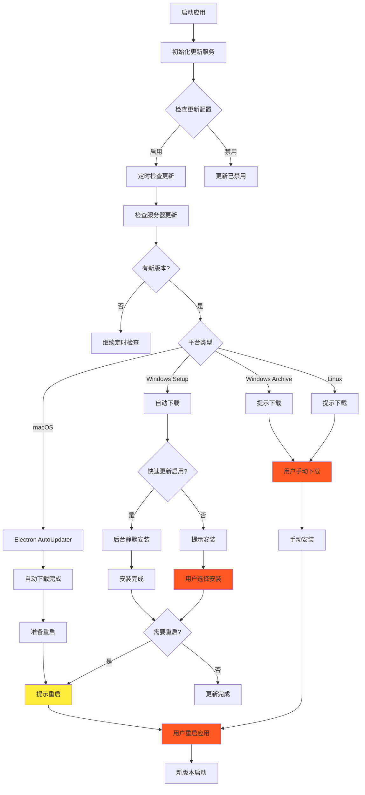
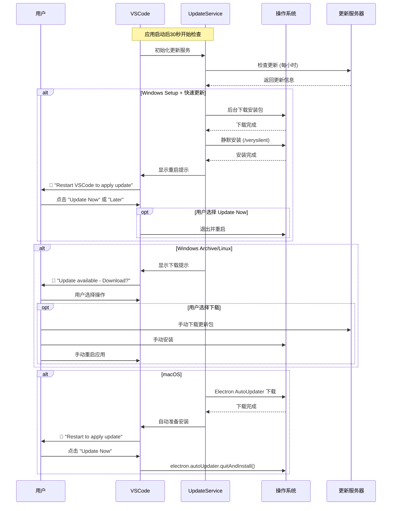

Q：产品自动更新处理VS Code本身的更新； this.notificationService.prompt( severity.Info, nls.localize('updateAvailableAfterRestart', "Restart {0} to apply the latest update.", this.productService.nameLong), actions, { sticky: true, priority: NotificationPriority.OPTIONAL } ); 这部分需要用户手动重启吗？ 介绍下 产品自动更新处理的全流程，标注这个过程中需要用户配合操作的部分

基于对 VSCode 自动更新代码的深度分析，我将详细解读产品自动更新的全流程，特别关注用户交互部分。

# VSCode 产品自动更新全流程分析

## 1. 更新流程总览

VSCode 的自动更新是一个复杂的多阶段流程，根据平台和配置的不同，用户参与程度也不同：



## 2. 用户交互节点详细分析

### 2.1 关键提示代码分析

您提到的这段代码位于更新流程的最后阶段：

```typescript
// 位置：src/vs/workbench/contrib/update/browser/update.ts:onUpdateReady()
private onUpdateReady(update: IUpdate): void {
    if (!(isWindows && this.productService.target !== 'user') && !this.shouldShowNotification()) {
        return;
    }

    const actions = [{
        label: nls.localize('updateNow', "Update Now"),
        run: () => this.updateService.quitAndInstall()  // 立即重启更新
    }, {
        label: nls.localize('later', "Later"),
        run: () => { }  // 稍后处理
    }];

    // 关键提示代码
    this.notificationService.prompt(
        severity.Info,
        nls.localize('updateAvailableAfterRestart', "Restart {0} to apply the latest update.", this.productService.nameLong),
        actions,
        { sticky: true }  // 持久显示通知
    );
}
```

**这个提示确实需要用户手动操作**，用户有两个选择：
1. **"Update Now"** - 立即重启应用以应用更新
2. **"Later"** - 稍后处理，通知会一直显示

### 2.2 不同平台的用户交互差异

#### Windows 平台用户交互流程

```typescript
// Windows 快速更新检查
private onUpdateDownloaded(update: IUpdate): void {
    if (isMacintosh) {
        return;
    }
    // 关键判断：Windows 快速更新
    if (this.configurationService.getValue('update.enableWindowsBackgroundUpdates') && 
        this.productService.target === 'user') {
        return;  // 无需用户交互，后台完成
    }

    if (!this.shouldShowNotification()) {
        return;
    }

    // 需要用户确认安装
    this.notificationService.prompt(
        severity.Info,
        nls.localize('updateAvailable', "There's an update available: {0} {1}", 
            this.productService.nameLong, productVersion),
        [{
            label: nls.localize('installUpdate', "Install Update"),
            run: () => this.updateService.applyUpdate()  // 用户操作：安装
        }, {
            label: nls.localize('later', "Later"),
            run: () => { }  // 用户操作：推迟
        }, {
            label: nls.localize('releaseNotes', "Release Notes"),
            run: () => {
                this.instantiationService.invokeFunction(accessor => showReleaseNotes(accessor, productVersion));
            }  // 用户操作：查看发布说明
        }]
    );
}
```

#### macOS 平台自动化程度更高

```typescript
// macOS 使用 Electron 的原生自动更新
// 位置：src/vs/platform/update/electron-main/updateService.darwin.ts
private onUpdateDownloaded(update: IUpdate): void {
    if (this.state.type !== StateType.Downloading) {
        return;
    }

    this.setState(State.Downloaded(update));
    
    // 自动转为 Ready 状态，减少用户交互
    this.setState(State.Ready(update));
}

protected override doQuitAndInstall(): void {
    this.logService.trace('update#quitAndInstall(): running raw#quitAndInstall()');
    electron.autoUpdater.quitAndInstall();  // 系统级重启安装
}
```

## 3. 完整的用户交互时序图



## 4. 核心架构组件

### 4.1 更新服务分层架构

```typescript
// 接口定义：src/vs/platform/update/common/update.ts
export interface IUpdateService {
    readonly _serviceBrand: undefined;
    readonly onStateChange: Event<State>;
    readonly state: State;
    
    checkForUpdates(explicit: boolean): Promise<void>;
    downloadUpdate(): Promise<void>;
    applyUpdate(): Promise<void>;
    quitAndInstall(): Promise<void>;  // 关键方法：退出并安装
    
    isLatestVersion(): Promise<boolean | undefined>;
    _applySpecificUpdate(packagePath: string): Promise<void>;
}
```

### 4.2 状态管理与事件驱动

```typescript
// 状态变化处理：src/vs/workbench/contrib/update/browser/update.ts
private async onUpdateStateChange(state: UpdateState): Promise<void> {
    this.updateStateContextKey.set(state.type);

    switch (state.type) {
        case StateType.Disabled:
            // 处理禁用状态，可能显示管理员警告
            if (state.reason === DisablementReason.RunningAsAdmin) {
                this.notificationService.notify({
                    severity: Severity.Info,
                    message: nls.localize('update service disabled', 
                        "Updates are disabled because you are running the user-scope installation of {0} as Administrator.", 
                        this.productService.nameLong),
                    actions: {
                        primary: [
                            toAction({
                                id: '',
                                label: nls.localize('learn more', "Learn More"),
                                run: () => this.openerService.open('https://aka.ms/vscode-windows-setup')
                            })
                        ]
                    },
                    neverShowAgain: { id: 'no-updates-running-as-admin', }
                });
            }
            break;

        case StateType.AvailableForDownload:
            this.onUpdateAvailable(state.update);  // Linux/Windows Archive
            break;

        case StateType.Downloaded:
            this.onUpdateDownloaded(state.update);  // Windows Setup
            break;

        case StateType.Ready:
            this.onUpdateReady(state.update);  // 需要重启 - 用户交互点
            break;
    }

    // 更新活动栏徽章
    this.updateActivityBadge(state);
}
```

### 4.3 Windows 后台更新详细实现

```typescript
// Windows 静默安装流程：src/vs/platform/update/electron-main/updateService.win32.ts
protected override async doApplyUpdate(): Promise<void> {
    if (this.state.type !== StateType.Downloaded) {
        return Promise.resolve(undefined);
    }

    if (!this.availableUpdate) {
        return Promise.resolve(undefined);
    }

    const update = this.state.update;
    this.setState(State.Updating(update));

    const cachePath = await this.cachePath;

    // 1. 创建更新标志文件
    this.availableUpdate.updateFilePath = path.join(cachePath, 
        `CodeSetup-${this.productService.quality}-${update.version}.flag`);

    await pfs.Promises.writeFile(this.availableUpdate.updateFilePath, 'flag');
    
    // 2. 启动静默安装进程
    const child = spawn(this.availableUpdate.packagePath, [
        '/verysilent',              // 静默安装
        '/log',                     // 记录日志
        `/update="${this.availableUpdate.updateFilePath}"`,  // 更新标志
        '/nocloseapplications',     // 不关闭应用
        '/mergetasks=runcode,!desktopicon,!quicklaunchicon'  // 任务配置
    ], {
        detached: true,
        stdio: ['ignore', 'ignore', 'ignore'],
        windowsVerbatimArguments: true
    });

    child.once('exit', () => {
        this.availableUpdate = undefined;
        this.setState(State.Idle(getUpdateType()));
    });

    // 3. 监控安装完成互斥量
    const readyMutexName = `${this.productService.win32MutexName}-ready`;
    const mutex = await import('@vscode/windows-mutex');

    // 轮询检查安装完成状态
    pollUntil(() => mutex.isActive(readyMutexName))
        .then(() => this.setState(State.Ready(update)));  // 安装完成，进入Ready状态
}
```

## 5. 用户配合操作总结

### 5.1 必须用户操作的场景

1. **最终重启确认** - 所有平台都需要
   ```typescript
   // 用户必须点击"Update Now"或手动重启
   this.notificationService.prompt(
       severity.Info,
       "Restart VSCode to apply the latest update.",
       actions,
       { sticky: true }  // 持久显示，直到用户操作
   );
   ```

2. **Linux/Windows Archive 手动下载**
   ```typescript
   private onUpdateAvailable(update: IUpdate): void {
       this.notificationService.prompt(
           severity.Info,
           nls.localize('thereIsUpdateAvailable', "There is an available update."),
           [{
               label: nls.localize('download update', "Download Update"),
               run: () => this.updateService.downloadUpdate()  // 打开下载页面
           }]
       );
   }
   ```

3. **权限提升场景**
   - Windows 管理员模式运行时的警告
   - macOS 签名验证失败时的手动处理

### 5.2 可选用户操作

1. **Windows Setup 安装确认**（当快速更新未启用）
2. **查看发布说明**
3. **推迟更新**（选择"Later"）

### 5.3 完全自动化场景

1. **Windows 用户版本 + 快速更新启用**
   ```typescript
   // 完全后台处理，无需用户交互
   if (fastUpdatesEnabled && this.productService.target === 'user') {
       this.doApplyUpdate();  // 直接后台安装
   }
   ```

2. **检查和下载阶段**（在所有平台都是自动的）

## 6. 设计亮点

1. **渐进式用户体验**：从完全自动到用户控制的不同级别
2. **平台优化**：充分利用各平台的原生更新机制
3. **可配置性**：用户可以选择更新策略（never/manual/start/default）
4. **错误恢复**：完善的回滚和错误处理机制
5. **状态透明**：清晰的状态反馈和用户提示

这个设计充分考虑了用户体验和系统可靠性的平衡，在保证更新可靠性的同时，最大程度减少了用户的操作负担。
