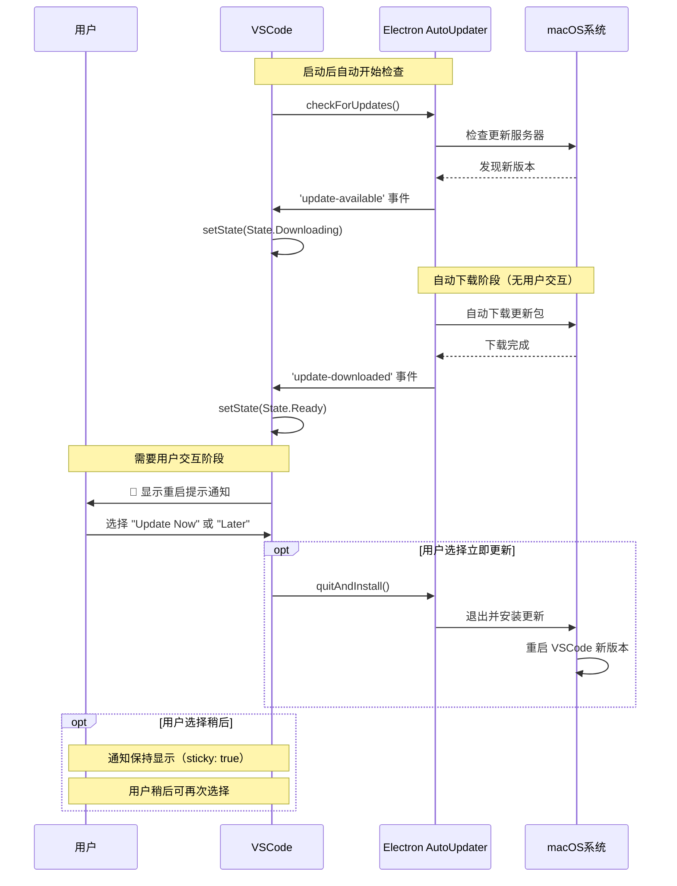

Q：macos 上会静默更新是吗？

基于对代码的深度分析，**macOS 上并不会完全静默更新**。让我详细解释 macOS 的更新行为：

## macOS 更新流程分析

### 1. macOS 更新的实际行为

从 `src/vs/platform/update/electron-main/updateService.darwin.ts` 的代码可以看出：

```typescript
private onUpdateDownloaded(update: IUpdate): void {
    if (this.state.type !== StateType.Downloading) {
        return;
    }

    this.setState(State.Downloaded(update));

    type UpdateDownloadedClassification = {
        owner: 'joaomoreno';
        newVersion: { classification: 'SystemMetaData'; purpose: 'FeatureInsight'; comment: 'The version number of the new VS Code that has been downloaded.' };
        comment: 'This is used to know how often VS Code has successfully downloaded the update.';
    };
    this.telemetryService.publicLog2<{ newVersion: String }, UpdateDownloadedClassification>('update:downloaded', { newVersion: update.version });

    // 关键：自动转为 Ready 状态，但不会自动重启
    this.setState(State.Ready(update));
}
```

### 2. macOS 的更新特点

**自动下载，但需要用户确认重启**：

1. **下载阶段**：完全自动
   ```typescript
   protected doCheckForUpdates(context: any): void {
       this.setState(State.CheckingForUpdates(context));
       electron.autoUpdater.checkForUpdates();  // 自动检查并下载
   }
   ```

2. **安装阶段**：需要用户操作
   ```typescript
   // 在 src/vs/workbench/contrib/update/browser/update.ts
   private onUpdateReady(update: IUpdate): void {
       // macOS 也会触发这个方法
       this.notificationService.prompt(
           severity.Info,
           nls.localize('updateAvailableAfterRestart', "Restart {0} to apply the latest update.", this.productService.nameLong),
           actions,
           { sticky: true }  // 持久显示，需要用户操作
       );
   }
   ```

### 3. 与 Windows 快速更新的对比

**Windows 用户版本 + 快速更新**（真正的静默更新）：
```typescript
// Windows 特有的静默更新逻辑
private onUpdateDownloaded(update: IUpdate): void {
    if (isMacintosh) {
        return;  // macOS 不进入此逻辑
    }
    
    // 只有 Windows 才有这个静默更新选项
    if (this.configurationService.getValue('update.enableWindowsBackgroundUpdates') && 
        this.productService.target === 'user') {
        return;  // Windows 静默完成，无需用户交互
    }
    
    // 其他情况（包括 macOS）都需要用户确认
    this.notificationService.prompt(/* ... */);
}
```

**macOS 没有类似的静默安装机制**，原因包括：

1. **系统安全限制**：macOS 的应用安装通常需要用户确认
2. **Electron AutoUpdater 限制**：虽然可以自动下载，但最终安装需要重启应用
3. **用户体验考虑**：避免在用户工作时突然重启应用

### 4. macOS 更新流程图



### 5. 配置验证

查看产品配置可以确认 macOS 没有静默更新选项：

```typescript
// macOS 的更新配置检查
protected override async initialize(): Promise<void> {
    await super.initialize();
    // macOS 没有类似 Windows 的 enableWindowsBackgroundUpdates 配置
    // 所有更新都需要最终的用户确认重启
}
```

## 总结

**macOS 上的 VSCode 更新不是完全静默的**：

1. ✅ **自动检查**：后台自动检查更新
2. ✅ **自动下载**：发现更新后自动下载
3. ❌ **静默安装**：**需要用户点击"Update Now"才会重启安装**
4. 🔄 **持久提示**：通知会一直显示直到用户处理

相比之下，只有 **Windows 用户版本且启用快速更新** 才能做到真正的静默更新（包括自动重启）。macOS 由于系统特性和安全考虑，始终需要用户的最终确认才能完成更新安装。
