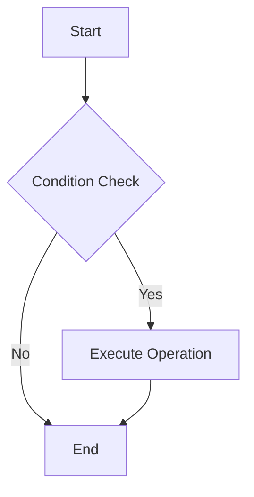
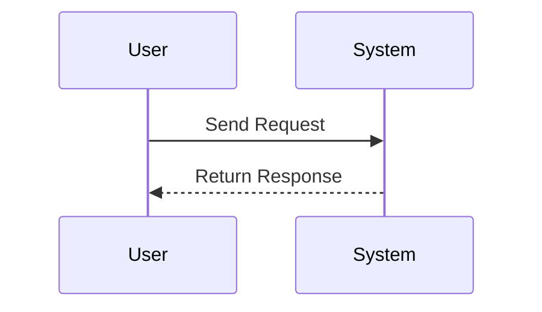
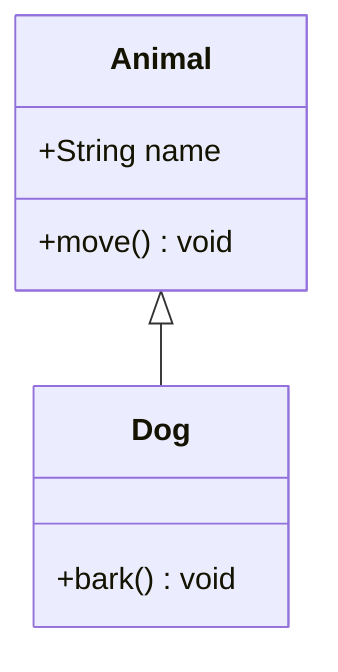

# Markdown Renderer

## Build Project
```bash
npm run build
```

## Render Files

### Render Default File (1.md)
```bash
node dist/index.js
```

### Render Specific File
```bash
node dist/index.js 2              # Render 2.md
node dist/index.js readme         # Render readme.md
node dist/index.js doc            # Render doc.md
```

### Render All Markdown Files
```bash
node dist/index.js --all
```

### Render All Files with Light Theme
```bash
node dist/index.js --all --theme light
```

### Shorthand Format
```bash
node dist/index.js -a -t light
```

## Theme Options

### Use Dark Theme (Default)
```bash
node dist/index.js doc --theme dark
```

### Use Light Theme
```bash
node dist/index.js doc --theme light
```

## Using npm Scripts

### Render Default File, Dark Theme
```bash
npm run render
```

### Render All Files, Dark Theme
```bash
npm run render:all
```

### Render All Files, Light Theme
```bash
npm run render:all:light
```

### Render All Files, Dark Theme
```bash
npm run render:all:dark
```

### Render Default File, Light Theme
```bash
npm run render:light
```

### Show Help Information
```bash
npm run render:help
```

## Usage

Usage: node dist/index.js [filename] [options]

Arguments:
  filename              Markdown filename to render (without extension)
                       Example: "1" will render "1.md"
                       If not specified, defaults to rendering "1.md"

Options:
  -a, --all            Render all found Markdown files
  -t, --theme <theme>  Specify theme (dark|light), default: dark
  -h, --help           Show help information

Examples:
  ```bash
  node dist/index.js                     # Render 1.md with dark theme
  node dist/index.js 2                   # Render 2.md with dark theme
  node dist/index.js --all               # Render all .md files with dark theme
  node dist/index.js --all --theme light # Render all .md files with light theme
  node dist/index.js readme --theme light # Render readme.md with light theme
  ```

## Example Charts

### Flowchart


### Sequence Diagram


### Class Diagram


## Code Examples

```typescript
import { MarkdownRenderer } from './renderer';

// Create renderer
const renderer = new MarkdownRenderer({
  theme: 'dark',
  basePath: './data'
});

// Render string
const html = await renderer.render(markdownString);

// Render file
const html = await renderer.renderFile('path/to/file.md');

// Switch theme
renderer.setTheme('light');
```

## Project Structure

```
apps/render/
├── src/
│   ├── renderer.ts          # Core renderer
│   ├── index.ts            # Command line entry
│   ├── example.ts          # Usage example
│   └── test-mermaid.ts     # Test file
├── data/                   # Markdown source files
├── output/                 # Render output
├── package.json
├── tsconfig.json
└── README.md
``` 