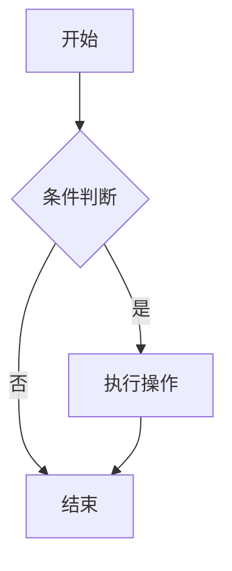
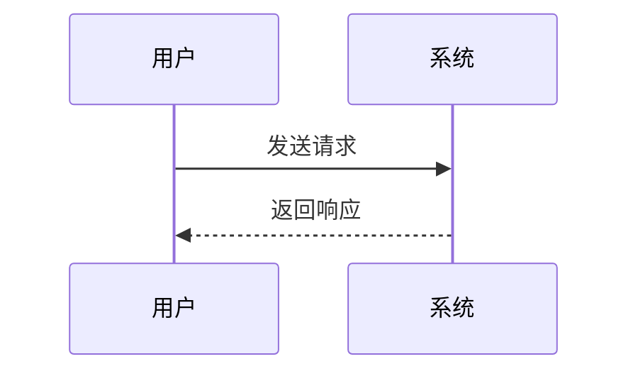
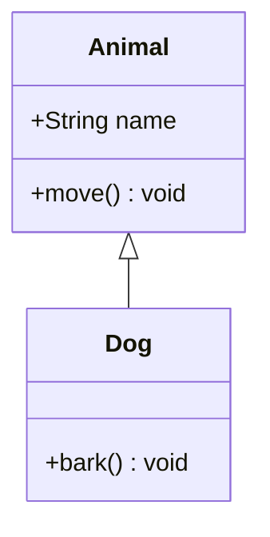

# Markdown Renderer

## 构建项目
npm run build
## 渲染文件

### 渲染默认文件 (1.md)
```bash
node dist/index.js
```

### 渲染指定文件
node dist/index.js 2              # 渲染 2.md
node dist/index.js readme         # 渲染 readme.md
node dist/index.js doc            # 渲染 doc.md
### 渲染所有 Markdown 文件
```bash
node dist/index.js --all
```
### 渲染所有文件，使用浅色主题
```bash
node dist/index.js --all --theme light
```

### 简写形式
```bash
node dist/index.js -a -t light
```
## 主题选项

### 使用暗色主题（默认）
```bash
node dist/index.js doc --theme dark
```

### 使用浅色主题
```bash
node dist/index.js doc --theme light
```

## 使用 npm scripts
### 渲染默认文件，暗色主题
```bash
npm run render
```
### 渲染所有文件，暗色主题
```bash
npm run render:all
```
### 渲染所有文件，浅色主题
```bash
npm run render:all:light
```
### 渲染所有文件，暗色主题
```bash
npm run render:all:dark
```
### 渲染默认文件，浅色主题
```bash
npm run render:light
```

### 显示帮助信息
```bash
npm run render:help
```

## 用法
用法: node dist/index.js [文件名] [选项]

参数:
  文件名              要渲染的 Markdown 文件名（不包含扩展名）
                     例如: "1" 将渲染 "1.md"
                     如果不指定，默认渲染 "1.md"

选项:
  -a, --all          渲染所有找到的 Markdown 文件
  -t, --theme <主题>  指定主题 (dark|light)，默认: dark
  -h, --help         显示帮助信息

示例:
  ```bash
  node dist/index.js                     # 渲染 1.md，使用暗色主题
  node dist/index.js 2                   # 渲染 2.md，使用暗色主题
  node dist/index.js --all               # 渲染所有 .md 文件，使用暗色主题
  node dist/index.js --all --theme light # 渲染所有 .md 文件，使用浅色主题
  node dist/index.js readme --theme light # 渲染 readme.md，使用浅色主题
  ```

## 示例图表
### 流程图


### 序列图


### 类图


## 代码示例

```typescript
import { MarkdownRenderer } from './renderer';

// 创建渲染器
const renderer = new MarkdownRenderer({
  theme: 'dark',
  basePath: './data'
});

// 渲染字符串
const html = await renderer.render(markdownString);

// 渲染文件
const html = await renderer.renderFile('path/to/file.md');

// 切换主题
renderer.setTheme('light');
```

## 项目结构

```
apps/render/
├── src/
│   ├── renderer.ts          # 核心渲染器
│   ├── index.ts            # 命令行入口
│   ├── example.ts          # 使用示例
│   └── test-mermaid.ts     # 测试文件
├── data/                   # Markdown 源文件
├── output/                 # 渲染输出
├── package.json
├── tsconfig.json
└── README.md